# Payment Service – Detailed Design Documentation

> **Version:** 1.0.0  
> **Date:** 2026-03-31  
> **Service:** payment-service (Spring Boot 3.3.5)  
> **Author:** TechWave Engineering

---

## Table of Contents

1. [Executive Summary](#1-executive-summary)
2. [High-Level Design (HLD)](#2-high-level-design-hld)
   - 2.1 [System Context Diagram](#21-system-context-diagram)
   - 2.2 [High-Level Architecture](#22-high-level-architecture)
   - 2.3 [Domain Model Overview](#23-domain-model-overview)
   - 2.4 [Technology Stack Decision Matrix](#24-technology-stack-decision-matrix)
3. [Low-Level Design (LLD)](#3-low-level-design-lld)
   - 3.1 [Package Structure & Class Diagram](#31-package-structure--class-diagram)
   - 3.2 [Controller Layer Design](#32-controller-layer-design)
   - 3.3 [Service Layer Design](#33-service-layer-design)
   - 3.4 [Repository Layer Design](#34-repository-layer-design)
   - 3.5 [Entity-DTO Mapping Design](#35-entity-dto-mapping-design)
   - 3.6 [Exception Handling Design](#36-exception-handling-design)
4. [Data Flow Diagrams](#4-data-flow-diagrams)
   - 4.1 [Create Bank Account Flow](#41-create-bank-account-flow)
   - 4.2 [Get Corporation by UUID Flow](#42-get-corporation-by-uuid-flow)
   - 4.3 [Audit Trail Retrieval Flow](#43-audit-trail-retrieval-flow)
   - 4.4 [Beneficial Owners Resolution Flow](#44-beneficial-owners-resolution-flow)
   - 4.5 [Update Person (PATCH) Flow](#45-update-person-patch-flow)
5. [Database Design](#5-database-design)
   - 5.1 [Entity-Relationship Diagram](#51-entity-relationship-diagram)
   - 5.2 [Table Specifications](#52-table-specifications)
6. [Security Architecture (OWASP)](#6-security-architecture-owasp)
   - 6.1 [Security Flow Diagram](#61-security-flow-diagram)
   - 6.2 [OWASP Compliance Matrix](#62-owasp-compliance-matrix)
   - 6.3 [Request Security Pipeline](#63-request-security-pipeline)
7. [Cross-Functional Requirements](#7-cross-functional-requirements)
   - 7.1 [Cross-Cutting Concerns Diagram](#71-cross-cutting-concerns-diagram)
   - 7.2 [Observability & Monitoring](#72-observability--monitoring)
   - 7.3 [Performance Characteristics](#73-performance-characteristics)
   - 7.4 [Scalability Considerations](#74-scalability-considerations)
   - 7.5 [Availability & Resilience](#75-availability--resilience)
8. [Deployment Architecture](#8-deployment-architecture)
   - 8.1 [Deployment Diagram](#81-deployment-diagram)
   - 8.2 [Container Deployment (Docker/K8s)](#82-container-deployment-dockerk8s)
   - 8.3 [CI/CD Pipeline](#83-cicd-pipeline)
   - 8.4 [Environment Strategy](#84-environment-strategy)
9. [Maintenance & Operations](#9-maintenance--operations)
   - 9.1 [Maintenance Workflow Diagram](#91-maintenance-workflow-diagram)
   - 9.2 [Logging Strategy](#92-logging-strategy)
   - 9.3 [Database Maintenance](#93-database-maintenance)
   - 9.4 [Dependency Update Strategy](#94-dependency-update-strategy)
   - 9.5 [Runbook Procedures](#95-runbook-procedures)
10. [Testing Strategy](#10-testing-strategy)
    - 10.1 [Test Pyramid](#101-test-pyramid)
    - 10.2 [Test Coverage Map](#102-test-coverage-map)
11. [API Contract Summary](#11-api-contract-summary)
12. [Glossary](#12-glossary)

---

## 1. Executive Summary

The **payment-service** is a Spring Boot 3.3.5 microservice responsible for managing core data entities within TechWave's payment processing ecosystem. It exposes a RESTful API for CRUD operations on legal entities (corporations, people), bank accounts, customer accounts, and read-only reference data (countries, currencies, silos). The service uses an H2 in-memory database, follows OWASP Top-10 security standards, and provides full audit-trail capabilities for mutable entities.

---

## 2. High-Level Design (HLD)

### 2.1 System Context Diagram

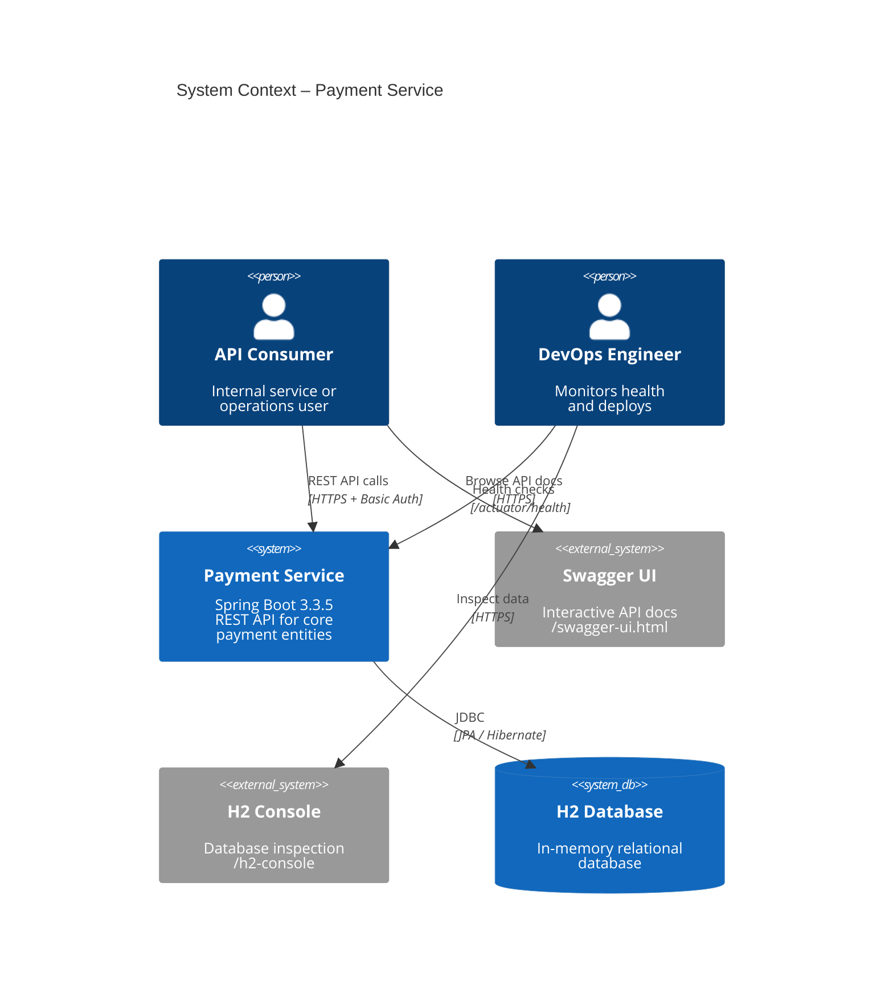

### 2.2 High-Level Architecture

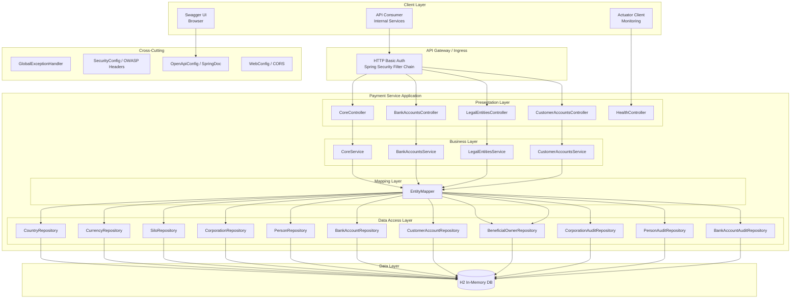

### 2.3 Domain Model Overview

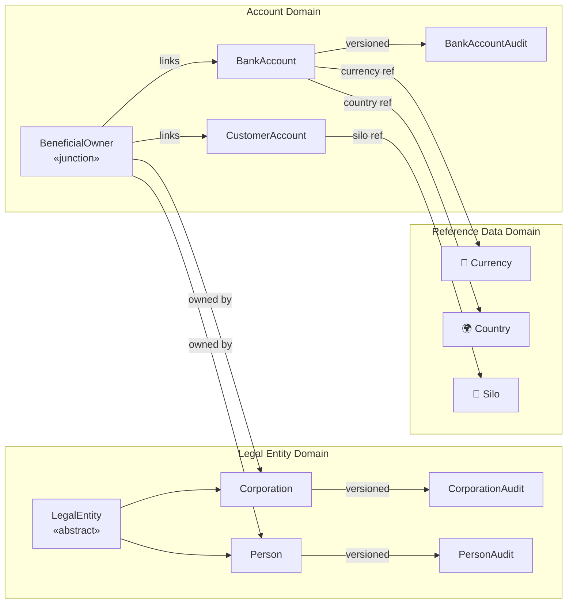

### 2.4 Technology Stack Decision Matrix

| Concern               | Choice             | Rationale                                                    |
|-----------------------|--------------------|--------------------------------------------------------------|
| Framework             | Spring Boot 3.3.5  | Mature, production-proven, Jakarta EE 10 support             |
| Language              | Java 17            | LTS, records, sealed classes, text blocks                    |
| ORM                   | Spring Data JPA    | Repository pattern, zero boilerplate CRUD                    |
| Database              | H2 (in-memory)     | Zero-config dev/test DB, SQL-compatible for migration to PG  |
| Security              | Spring Security 6  | Filter chain, OWASP headers, HTTP Basic                      |
| API Docs              | SpringDoc 2.8.9    | OpenAPI 3.0 + Swagger UI auto-generation                     |
| Validation            | Jakarta Validation  | Declarative, annotation-driven input validation              |
| Testing               | JUnit 5 + Cucumber | Unit, integration, BDD coverage                              |
| Code Coverage         | JaCoCo 0.8.12      | Build-time coverage reporting                                |
| Build                 | Maven 3.9+         | Standard, reproducible builds                                |

---

## 3. Low-Level Design (LLD)

### 3.1 Package Structure & Class Diagram

```mermaid
classDiagram
    direction TB

    namespace api {
        class CoreApi {
            <<interface>>
            +getCountries() ResponseEntity~List~Country~~
            +getCountry(id) ResponseEntity~Country~
            +getCurrencies() ResponseEntity~List~Currency~~
            +getCurrency(id) ResponseEntity~Currency~
            +getSilos() ResponseEntity~List~Silo~~
            +getSilo(id) ResponseEntity~Silo~
        }
        class BankAccountsApi {
            <<interface>>
            +createBankAccount(ba) ResponseEntity~BankAccount~
            +getBankAccount(uuid) ResponseEntity~BankAccount~
            +getBankAccountAuditTrail(uuid) ResponseEntity~List~BankAccountAudit~~
            +getBankAccountBeneficialOwners(uuid) ResponseEntity~List~LegalEntity~~
        }
        class LegalEntitiesApi {
            <<interface>>
            +createCorporation(corp) ResponseEntity~Corporation~
            +getCorporation(uuid) ResponseEntity~Corporation~
            +updateCorporation(uuid, corp) ResponseEntity~Corporation~
            +getCorporationAuditTrail(uuid) ResponseEntity~List~CorporationAudit~~
            +getCorporationByCode(country, code) ResponseEntity~Corporation~
            +createPerson(person) ResponseEntity~Person~
            +getPerson(uuid) ResponseEntity~Person~
            +updatePerson(uuid, person) ResponseEntity~Person~
            +getPersonAuditTrail(uuid) ResponseEntity~List~PersonAudit~~
        }
        class CustomerAccountsApi {
            <<interface>>
            +getCustomerAccount(uuid) ResponseEntity~CustomerAccount~
            +getCustomerAccountBeneficialOwners(uuid) ResponseEntity~List~LegalEntity~~
        }
    }

    namespace controller {
        class CoreController {
            -coreService: CoreService
        }
        class BankAccountsController {
            -bankAccountsService: BankAccountsService
        }
        class LegalEntitiesController {
            -legalEntitiesService: LegalEntitiesService
        }
        class CustomerAccountsController {
            -customerAccountsService: CustomerAccountsService
        }
    }

    namespace service {
        class CoreService {
            -countryRepository: CountryRepository
            -currencyRepository: CurrencyRepository
            -siloRepository: SiloRepository
            -mapper: EntityMapper
        }
        class BankAccountsService {
            -bankAccountRepository: BankAccountRepository
            -auditRepository: BankAccountAuditRepository
            -beneficialOwnerRepository: BeneficialOwnerRepository
            -mapper: EntityMapper
        }
        class LegalEntitiesService {
            -corporationRepository: CorporationRepository
            -corporationAuditRepository: CorporationAuditRepository
            -personRepository: PersonRepository
            -personAuditRepository: PersonAuditRepository
            -mapper: EntityMapper
        }
        class CustomerAccountsService {
            -customerAccountRepository: CustomerAccountRepository
            -beneficialOwnerRepository: BeneficialOwnerRepository
            -mapper: EntityMapper
        }
    }

    namespace mapper {
        class EntityMapper {
            +toDto(CountryEntity) Country
            +toDto(CurrencyEntity) Currency
            +toDto(SiloEntity) Silo
            +toDto(CorporationEntity) Corporation
            +toEntity(Corporation) CorporationEntity
            +toDto(PersonEntity) Person
            +toEntity(Person) PersonEntity
            +toDto(BankAccountEntity) BankAccount
            +toEntity(BankAccount) BankAccountEntity
            +toDto(CustomerAccountEntity) CustomerAccount
            +toAuditEntity(CorporationEntity, int) CorporationAuditEntity
            +toAuditEntity(PersonEntity, int) PersonAuditEntity
            +toAuditEntity(BankAccountEntity, int) BankAccountAuditEntity
            +toLegalEntityDto(BeneficialOwnerEntity, PersonEntity) LegalEntity
            +toLegalEntityDto(BeneficialOwnerEntity, CorporationEntity) LegalEntity
        }
    }

    CoreController ..|> CoreApi
    BankAccountsController ..|> BankAccountsApi
    LegalEntitiesController ..|> LegalEntitiesApi
    CustomerAccountsController ..|> CustomerAccountsApi

    CoreController --> CoreService
    BankAccountsController --> BankAccountsService
    LegalEntitiesController --> LegalEntitiesService
    CustomerAccountsController --> CustomerAccountsService

    CoreService --> EntityMapper
    BankAccountsService --> EntityMapper
    LegalEntitiesService --> EntityMapper
    CustomerAccountsService --> EntityMapper
```

### 3.2 Controller Layer Design

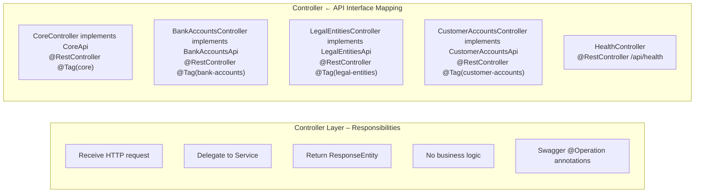

### 3.3 Service Layer Design

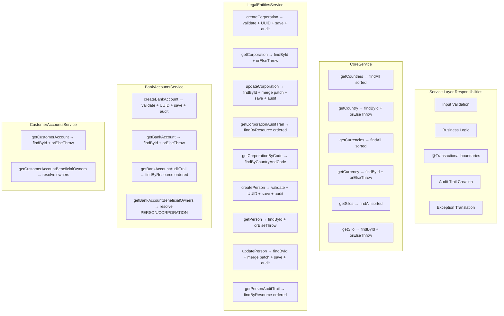

### 3.4 Repository Layer Design

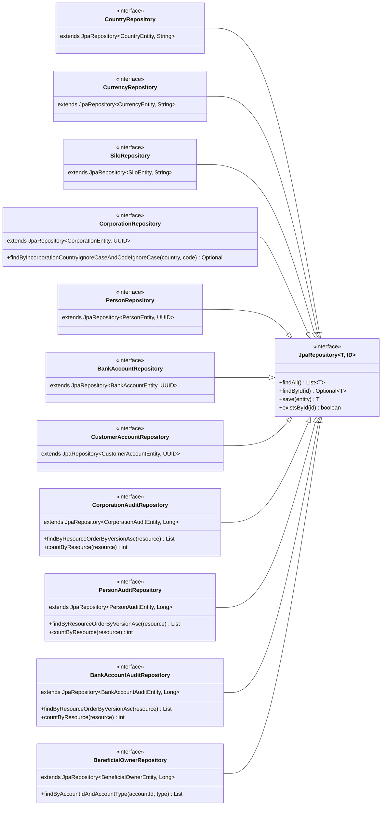

### 3.5 Entity-DTO Mapping Design

```mermaid
graph LR
    subgraph "JPA Entities (Data Layer)"
        CE[CountryEntity]
        CUE[CurrencyEntity]
        SE[SiloEntity]
        CRE[CorporationEntity]
        PE[PersonEntity]
        BAE[BankAccountEntity]
        CAE[CustomerAccountEntity]
        CRAE[CorporationAuditEntity]
        PAE[PersonAuditEntity]
        BAAE[BankAccountAuditEntity]
        BOE[BeneficialOwnerEntity]
    end

    EM[EntityMapper<br/>@Component]

    subgraph "DTOs (API Layer)"
        CD[Country]
        CUD[Currency]
        SD[Silo]
        CRD[Corporation]
        PD[Person]
        BAD[BankAccount]
        CAD[CustomerAccount]
        CRAD[CorporationAudit]
        PAD[PersonAudit]
        BAAD[BankAccountAudit]
        LED[LegalEntity]
    end

    CE -- "toDto()" --> EM --> CD
    CUE -- "toDto()" --> EM --> CUD
    SE -- "toDto()" --> EM --> SD
    CRE -- "toDto()" --> EM --> CRD
    PE -- "toDto()" --> EM --> PD
    BAE -- "toDto()" --> EM --> BAD
    CAE -- "toDto()" --> EM --> CAD
    CRD -- "toEntity()" --> EM --> CRE
    PD -- "toEntity()" --> EM --> PE
    BAD -- "toEntity()" --> EM --> BAE
    BOE -- "toLegalEntityDto()" --> EM --> LED
```

### 3.6 Exception Handling Design

```mermaid
graph TB
    subgraph "Exception Classes"
        RE[ResourceNotFoundException]
        BR[BadRequestException]
        UA[UnauthorizedException]
        FO[ForbiddenOperationException]
        MV[MethodArgumentNotValidException<br/>«Jakarta Bean Validation»]
        MT[MethodArgumentTypeMismatchException<br/>«Spring Type Conversion»]
        GE[Exception<br/>«catch-all»]
    end

    GEH[GlobalExceptionHandler<br/>@RestControllerAdvice]

    subgraph "HTTP Responses"
        R404["404 Not Found<br/>{status, error, message}"]
        R400["400 Bad Request<br/>{status, error, message, messages[]}"]
        R401["401 Unauthorized<br/>{status, error, message}"]
        R403["403 Forbidden<br/>{status, error, message}"]
        R500["500 Internal Server Error<br/>{status, error, message}<br/>OWASP: generic message only"]
    end

    RE --> GEH --> R404
    BR --> GEH --> R400
    MV --> GEH --> R400
    MT --> GEH --> R400
    UA --> GEH --> R401
    FO --> GEH --> R403
    GE --> GEH --> R500
```

---

## 4. Data Flow Diagrams

### 4.1 Create Bank Account Flow

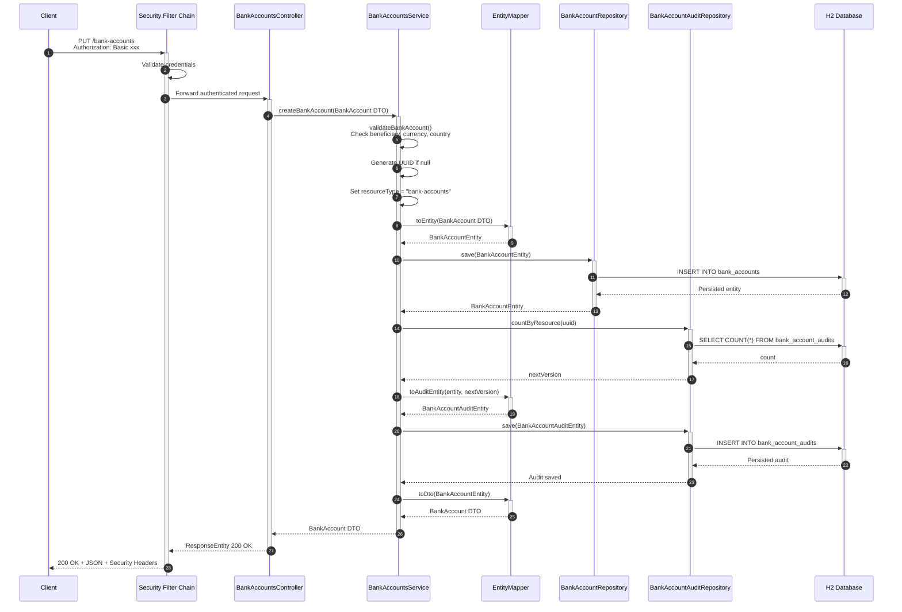

### 4.2 Get Corporation by UUID Flow

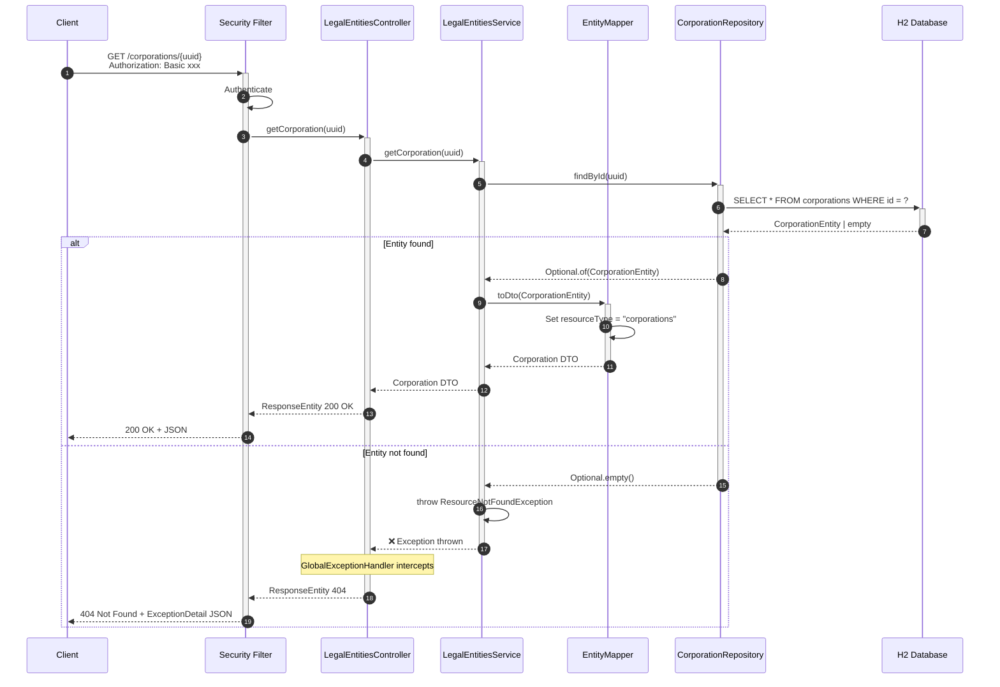

### 4.3 Audit Trail Retrieval Flow

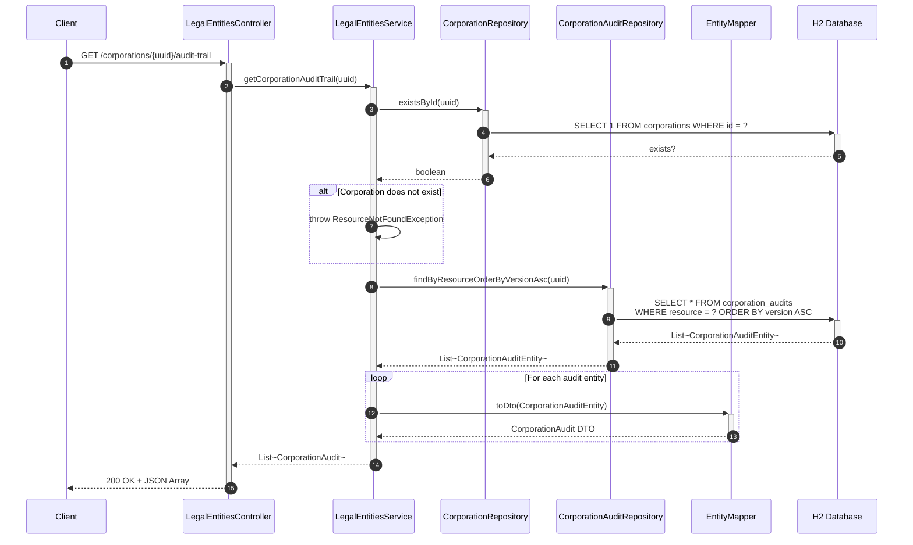

### 4.4 Beneficial Owners Resolution Flow

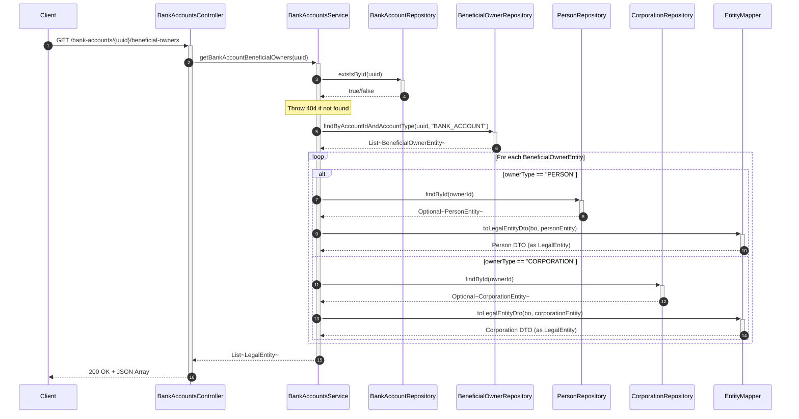

### 4.5 Update Person (PATCH) Flow

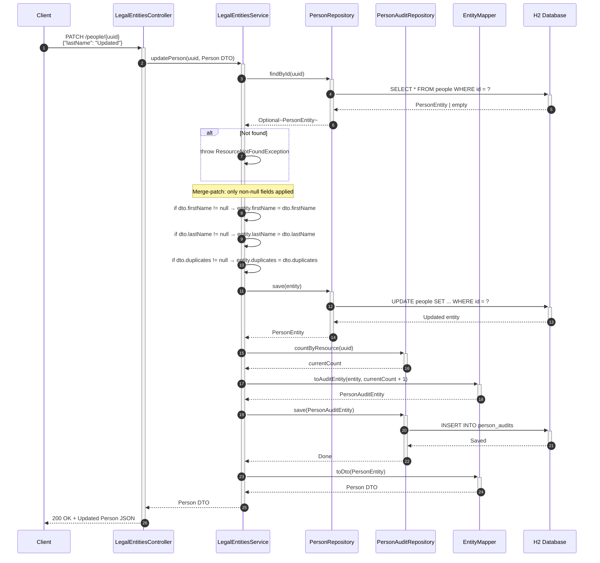

---

## 5. Database Design

### 5.1 Entity-Relationship Diagram

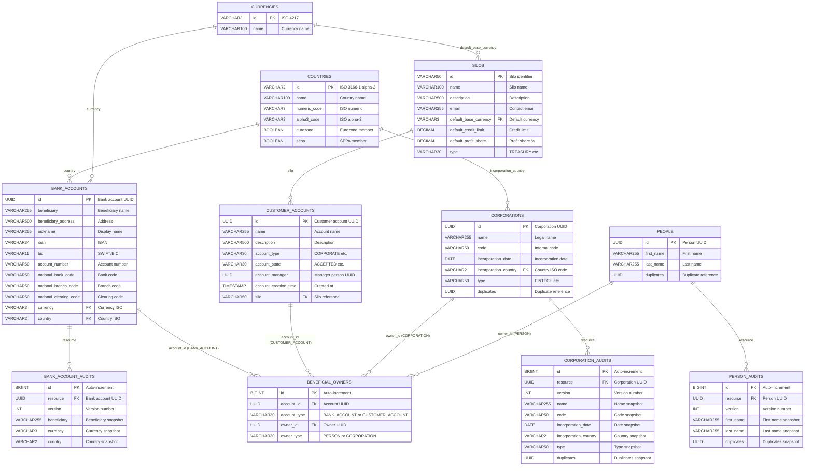

### 5.2 Table Specifications

| Table                 | PK Type   | Record Volume | Write Pattern          | Read Pattern       |
|-----------------------|-----------|:-------------:|------------------------|-------------------|
| `countries`           | VARCHAR(2) | ~250         | Seed only (read-only)  | Frequent reads    |
| `currencies`          | VARCHAR(3) | ~170         | Seed only (read-only)  | Frequent reads    |
| `silos`               | VARCHAR(50)| ~10          | Seed only (read-only)  | Moderate reads    |
| `corporations`        | UUID       | ~10K         | Create + PATCH updates | Point lookups     |
| `people`              | UUID       | ~50K         | Create + PATCH updates | Point lookups     |
| `bank_accounts`       | UUID       | ~10K         | PUT (idempotent)       | Point lookups     |
| `customer_accounts`   | UUID       | ~5K          | Seed only (read-only)  | Point lookups     |
| `corporation_audits`  | BIGINT     | ~50K         | Append-only            | Range by resource |
| `person_audits`       | BIGINT     | ~200K        | Append-only            | Range by resource |
| `bank_account_audits` | BIGINT     | ~50K         | Append-only            | Range by resource |
| `beneficial_owners`   | BIGINT     | ~30K         | Seed / periodic        | Filter by account |

---

## 6. Security Architecture (OWASP)

### 6.1 Security Flow Diagram

```mermaid
sequenceDiagram
    autonumber
    participant Client
    participant CORS as CORS Filter<br/>(WebConfig)
    participant SEC as SecurityFilterChain<br/>(SecurityConfig)
    participant HEADERS as Security Headers<br/>(OWASP)
    participant AUTH as HTTP Basic Auth
    participant CTRL as Controller
    participant EXC as GlobalExceptionHandler

    Client->>+CORS: HTTP Request
    CORS->>CORS: Validate Origin, Methods, Headers
    CORS->>+SEC: Forward if CORS OK

    SEC->>SEC: Check request path

    alt Public endpoint (/api/health, /actuator/*, /swagger-ui/**)
        SEC->>+CTRL: Permit without auth
    else Protected endpoint
        SEC->>+AUTH: Extract Basic credentials
        AUTH->>AUTH: Validate username/password
        alt Valid credentials
            AUTH->>+CTRL: Forward authenticated request
        else Invalid credentials
            AUTH-->>-Client: 401 Unauthorized
        end
    end

    CTRL->>CTRL: Process request
    alt Success
        CTRL-->>SEC: ResponseEntity
    else Business exception
        CTRL->>+EXC: Exception thrown
        EXC->>EXC: Map to ExceptionDetail
        EXC-->>-SEC: Error ResponseEntity
    end

    SEC->>+HEADERS: Apply security headers
    HEADERS->>HEADERS: X-Content-Type-Options: nosniff
    HEADERS->>HEADERS: X-Frame-Options: SAMEORIGIN
    HEADERS->>HEADERS: X-XSS-Protection: 1; mode=block
    HEADERS->>HEADERS: Strict-Transport-Security
    HEADERS->>HEADERS: Content-Security-Policy
    HEADERS->>HEADERS: Referrer-Policy
    HEADERS->>HEADERS: Permissions-Policy
    HEADERS->>HEADERS: Cache-Control: no-cache
    HEADERS-->>-SEC: Headers applied

    SEC-->>-CORS: Response + Headers
    CORS-->>-Client: Final HTTP Response
```

### 6.2 OWASP Compliance Matrix

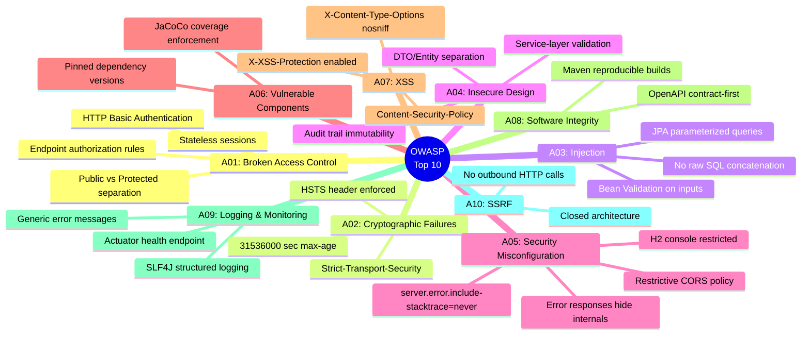

### 6.3 Request Security Pipeline

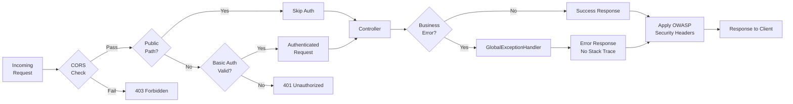

---

## 7. Cross-Functional Requirements

### 7.1 Cross-Cutting Concerns Diagram

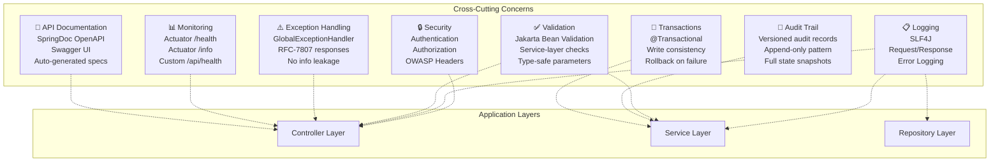

### 7.2 Observability & Monitoring

| Capability           | Endpoint/Tool           | Description                                    |
|----------------------|-------------------------|------------------------------------------------|
| Health Check         | `GET /actuator/health`  | Liveness/readiness probe (public)              |
| Info                 | `GET /actuator/info`    | Application metadata (public)                  |
| Custom Health        | `GET /api/health`       | Service name + status (public)                 |
| Structured Logging   | SLF4J + Logback         | JSON-structured logs for aggregation           |
| Error Logging        | GlobalExceptionHandler  | All 5xx errors logged with stack trace         |
| API Documentation    | `/swagger-ui.html`      | Self-documenting API explorer                  |
| DB Inspection        | `/h2-console`           | Dev-only database browser                      |
| Code Coverage        | JaCoCo HTML report      | `target/site/jacoco/index.html`                |

### 7.3 Performance Characteristics

| Metric                     | Target          | Design Decision                              |
|----------------------------|-----------------|----------------------------------------------|
| API Latency (p95)          | < 50ms          | In-memory H2, no network hops               |
| Throughput                 | > 1000 req/s    | Stateless, connection pooling (HikariCP)     |
| Startup Time               | < 5s            | No heavy initialization, DDL via SQL scripts |
| Memory Footprint           | < 256 MB        | Embedded H2, minimal entity graph            |
| Connection Pool Size       | 10 (default)    | HikariCP default for H2                      |

### 7.4 Scalability Considerations

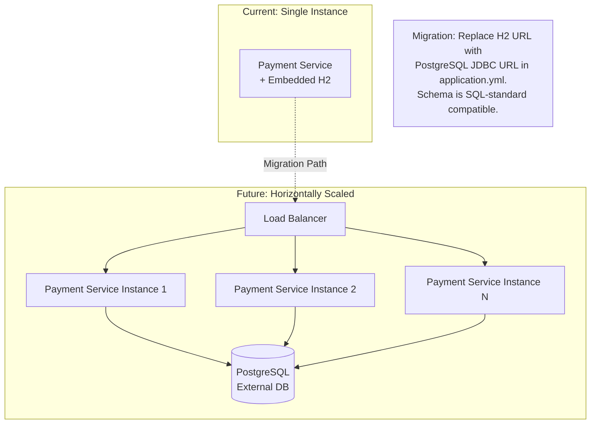

### 7.5 Availability & Resilience

| Concern                | Strategy                                               |
|------------------------|--------------------------------------------------------|
| Data Loss              | H2 in-memory — ephemeral by design; migrate to PG for persistence |
| Service Restart        | Seed data auto-loads via `schema.sql` + `data.sql`     |
| Connection Exhaustion  | HikariCP defaults with connection validation           |
| Unhandled Exceptions   | GlobalExceptionHandler returns 500 without crash        |
| Session State          | Stateless (no sessions) — safe for horizontal scaling   |

---

## 8. Deployment Architecture

### 8.1 Deployment Diagram

```mermaid
graph TB
    subgraph "Developer Workstation"
        IDE[IntelliJ IDEA / VS Code]
        MVN[Maven Build]
        H2DEV[(H2 In-Memory)]
    end

    subgraph "CI/CD Pipeline"
        GIT[Git Repository]
        CI[CI Server<br/>GitHub Actions / Jenkins]
        ART[Artifact Registry<br/>Maven / Docker]
    end

    subgraph "Staging Environment"
        STG_LB[Load Balancer]
        STG_APP[Payment Service<br/>Docker Container]
        STG_DB[(H2 / PostgreSQL)]
    end

    subgraph "Production Environment"
        PROD_LB[Load Balancer /<br/>API Gateway]
        PROD_APP1[Payment Service<br/>Pod 1]
        PROD_APP2[Payment Service<br/>Pod 2]
        PROD_DB[(PostgreSQL<br/>Primary)]
        PROD_DBR[(PostgreSQL<br/>Read Replica)]
        PROM[Prometheus]
        GRAF[Grafana]
    end

    IDE --> MVN --> GIT
    GIT --> CI
    CI --> ART

    ART --> STG_APP
    STG_LB --> STG_APP --> STG_DB

    ART --> PROD_APP1 & PROD_APP2
    PROD_LB --> PROD_APP1 & PROD_APP2
    PROD_APP1 & PROD_APP2 --> PROD_DB
    PROD_DB --> PROD_DBR
    PROD_APP1 & PROD_APP2 --> PROM --> GRAF
```

### 8.2 Container Deployment (Docker/K8s)

```mermaid
graph TB
    subgraph "Docker Image"
        JRE[Eclipse Temurin JRE 17]
        JAR[payment-service-0.0.1-SNAPSHOT.jar]
        CFG[application.yml<br/>Externalized via env vars]
    end

    subgraph "Kubernetes Deployment"
        direction TB
        NS[Namespace: techwave]

        subgraph "Deployment: payment-service"
            POD1[Pod 1<br/>payment-service:latest<br/>CPU: 500m, Mem: 512Mi]
            POD2[Pod 2<br/>payment-service:latest<br/>CPU: 500m, Mem: 512Mi]
        end

        SVC[Service: payment-service<br/>Type: ClusterIP<br/>Port: 8080]
        ING[Ingress<br/>Host: api.techwave.com<br/>Path: /payment-service/*]
        CM[ConfigMap<br/>application.yml overrides]
        SEC_K[Secret<br/>DB credentials<br/>API keys]
        HPA[HorizontalPodAutoscaler<br/>min: 2, max: 5<br/>CPU target: 70%]
    end

    subgraph "Probes"
        LP[Liveness Probe<br/>GET /actuator/health<br/>Period: 30s]
        RP[Readiness Probe<br/>GET /actuator/health<br/>Period: 10s]
    end

    ING --> SVC --> POD1 & POD2
    CM --> POD1 & POD2
    SEC_K --> POD1 & POD2
    LP --> POD1 & POD2
    RP --> POD1 & POD2
    HPA --> POD1 & POD2
```

### 8.3 CI/CD Pipeline

```mermaid
graph LR
    subgraph "Source"
        A[Git Push /<br/>Pull Request]
    end

    subgraph "Build Stage"
        B[Checkout Code]
        C[mvn clean compile<br/>+ OpenAPI generate]
        D[mvn test<br/>JUnit + Cucumber]
        E[JaCoCo Report<br/>Coverage Gate ≥ 80%]
    end

    subgraph "Quality Gate"
        F[SonarQube Scan<br/>Code Quality]
        G[OWASP Dependency<br/>Check]
        H[License Compliance]
    end

    subgraph "Package Stage"
        I[mvn package<br/>-DskipTests]
        J[Docker Build<br/>Multi-stage]
        K[Push to Registry<br/>tag: git-sha]
    end

    subgraph "Deploy Stage"
        L[Deploy to Staging]
        M[Integration Tests]
        N{Gate<br/>Passed?}
        O[Deploy to Production<br/>Rolling Update]
        P[Smoke Tests]
    end

    A --> B --> C --> D --> E
    E --> F --> G --> H
    H --> I --> J --> K
    K --> L --> M --> N
    N -->|Yes| O --> P
    N -->|No| Q[Rollback & Alert]
```

### 8.4 Environment Strategy

| Environment   | Database          | Auth                | Purpose                     |
|---------------|-------------------|---------------------|-----------------------------|
| **Local**     | H2 in-memory      | admin/admin         | Developer workstation       |
| **CI/Test**   | H2 in-memory      | Mock users          | Automated test execution    |
| **Staging**   | PostgreSQL         | OAuth2 / LDAP       | Pre-production validation   |
| **Production**| PostgreSQL (HA)    | OAuth2 / LDAP / SSO | Live traffic                |

---

## 9. Maintenance & Operations

### 9.1 Maintenance Workflow Diagram

```mermaid
graph TB
    subgraph "Monitoring & Alerting"
        A[Actuator Health Check<br/>every 30s]
        B{Status<br/>UP?}
        C[Alert: PagerDuty / Slack]
    end

    subgraph "Incident Response"
        D[Triage Incident]
        E{Severity?}
        F[P1: Immediate fix<br/>Hotfix branch]
        G[P2: Next sprint<br/>Bug ticket]
        H[P3: Backlog<br/>Tech debt]
    end

    subgraph "Change Management"
        I[Feature Request /<br/>Bug Report]
        J[Create Branch]
        K[Implement + Test]
        L[Pull Request Review]
        M[Merge to main]
        N[CI/CD Pipeline]
        O[Deploy]
    end

    subgraph "Scheduled Maintenance"
        P[Weekly: Dependency audit<br/>OWASP check]
        Q[Monthly: Performance review<br/>Capacity planning]
        R[Quarterly: Security review<br/>Penetration test]
        S[Yearly: Major version upgrade<br/>Java / Spring Boot]
    end

    A --> B
    B -->|No| C --> D --> E
    E -->|P1| F --> J
    E -->|P2| G --> I
    E -->|P3| H

    I --> J --> K --> L --> M --> N --> O
```

### 9.2 Logging Strategy

```mermaid
graph LR
    subgraph "Log Levels"
        ERROR[ERROR<br/>Unhandled exceptions<br/>System failures]
        WARN[WARN<br/>Degraded performance<br/>Deprecated usage]
        INFO[INFO<br/>Request processing<br/>Business events]
        DEBUG[DEBUG<br/>Service method entry/exit<br/>SQL queries]
        TRACE[TRACE<br/>Full request/response<br/>Entity state changes]
    end

    subgraph "Log Destinations"
        STDOUT[STDOUT<br/>Container logs]
        FILE[Rolling file<br/>Local dev only]
        AGG[Log Aggregator<br/>ELK / Splunk / Loki]
    end

    subgraph "Log Content (Structured)"
        TS[timestamp]
        LVL[level]
        THR[thread]
        CLS[logger class]
        MSG[message]
        CTX["context (requestId,<br/>userId, traceId)"]
    end

    ERROR & WARN & INFO --> STDOUT --> AGG
    DEBUG & TRACE --> FILE
```

### 9.3 Database Maintenance

| Task                              | Frequency  | Procedure                                           |
|-----------------------------------|------------|-----------------------------------------------------|
| Schema migration                  | Per release | Add new `schema-vX.sql`; use Flyway/Liquibase (future) |
| Seed data update                  | Per release | Update `data.sql`; review in PR                     |
| Audit table growth monitoring     | Weekly     | Query row counts; archive old audits if needed      |
| Index optimization                | Monthly    | Analyze slow queries; add indexes on audit.resource |
| Backup (production PostgreSQL)    | Daily      | pg_dump automated; WAL archiving for PITR           |
| H2 → PostgreSQL migration         | One-time   | Change JDBC URL; verify SQL compatibility           |

### 9.4 Dependency Update Strategy

```mermaid
graph TB
    A[Dependabot /<br/>Renovate PR] --> B{Security<br/>CVE?}
    B -->|Yes| C[Immediate patch<br/>Priority merge]
    B -->|No| D{Major<br/>Version?}
    D -->|Yes| E[Scheduled upgrade<br/>Dedicated sprint task]
    D -->|No| F[Standard PR flow<br/>Review + test + merge]

    C --> G[Run full test suite]
    E --> G
    F --> G

    G --> H{Tests<br/>Pass?}
    H -->|Yes| I[Merge & Deploy]
    H -->|No| J[Fix compatibility<br/>issues]
    J --> G
```

### 9.5 Runbook Procedures

| Scenario                          | Action                                                           |
|-----------------------------------|------------------------------------------------------------------|
| Service won't start               | Check `application.yml` syntax, Java version, port conflicts     |
| 401 on all requests               | Verify `spring.security.user.*` config; check credential encoding|
| 500 Internal Server Error         | Check logs for stack trace; inspect GlobalExceptionHandler       |
| H2 data lost after restart        | Expected (in-memory); `data.sql` reloads on startup              |
| Slow response times               | Check HikariCP pool; enable `spring.jpa.show-sql`; add indexes  |
| Swagger UI not loading            | Verify `/swagger-ui.html` is in `permitAll()` list              |
| Audit trail missing entries       | Check `@Transactional` on create/update methods                 |
| Cucumber tests failing            | Ensure `test/resources/data.sql` matches expected seed data      |

---

## 10. Testing Strategy

### 10.1 Test Pyramid

```mermaid
graph TB
    subgraph "Test Pyramid"
        direction TB
        E2E["🔺 E2E / BDD Tests<br/>Cucumber Feature Files<br/>55+ scenarios<br/>Full HTTP + Security"]
        INT["🔷 Integration Tests<br/>Controller Tests (MockMvc)<br/>30+ tests<br/>Spring context + H2"]
        UNIT["🟩 Unit Tests<br/>Service Tests, Mapper Tests,<br/>Exception Handler Tests<br/>70+ tests<br/>Fast, isolated"]
    end

    E2E --- INT --- UNIT

    style UNIT fill:#4CAF50,color:#fff
    style INT fill:#2196F3,color:#fff
    style E2E fill:#FF9800,color:#fff
```

### 10.2 Test Coverage Map

```mermaid
graph TB
    subgraph "Coverage by Layer"
        direction TB

        subgraph "Controllers (Integration)"
            CT1[CoreControllerTest<br/>10 tests]
            CT2[BankAccountsControllerTest<br/>10 tests]
            CT3[LegalEntitiesControllerTest<br/>16 tests]
            CT4[CustomerAccountsControllerTest<br/>5 tests]
            CT5[HealthControllerTest<br/>1 test]
        end

        subgraph "Services (Unit)"
            ST1[CoreServiceTest<br/>10 tests]
            ST2[BankAccountsServiceTest<br/>11 tests]
            ST3[LegalEntitiesServiceTest<br/>17 tests]
            ST4[CustomerAccountsServiceTest<br/>4 tests]
        end

        subgraph "Cross-Cutting"
            XT1[GlobalExceptionHandlerTest<br/>5 tests]
            XT2[EntityMapperTest<br/>12 tests]
            XT3[SecurityHeadersTest<br/>8 tests]
            XT4[PaymentServiceApplicationTests<br/>3 tests]
        end

        subgraph "BDD (End-to-End)"
            BDD1[core.feature<br/>12 scenarios]
            BDD2[bank-accounts.feature<br/>12 scenarios]
            BDD3[legal-entities.feature<br/>18 scenarios]
            BDD4[customer-accounts.feature<br/>5 scenarios]
            BDD5[security.feature<br/>8 scenarios]
        end
    end
```

---

## 11. API Contract Summary

```mermaid
graph LR
    subgraph "Core API"
        direction TB
        GC[GET /countries]
        GCI[GET /countries/{id}]
        GCU[GET /currencies]
        GCUI[GET /currencies/{id}]
        GS[GET /silos]
        GSI[GET /silos/{id}]
    end

    subgraph "Legal Entities API"
        direction TB
        PC[POST /corporations]
        GCR[GET /corporations/{uuid}]
        PAC[PATCH /corporations/{uuid}]
        GCRA[GET /corporations/{uuid}/audit-trail]
        GCRC[GET /corporations/{country}/{code}]
        PP[POST /people]
        GP[GET /people/{uuid}]
        PAP[PATCH /people/{uuid}]
        GPA[GET /people/{uuid}/audit-trail]
    end

    subgraph "Bank Accounts API"
        direction TB
        PBA[PUT /bank-accounts]
        GBA[GET /bank-accounts/{uuid}]
        GBAA[GET /bank-accounts/{uuid}/audit-trail]
        GBAB[GET /bank-accounts/{uuid}/beneficial-owners]
    end

    subgraph "Customer Accounts API"
        direction TB
        GCAA[GET /customer-accounts/{uuid}]
        GCAB[GET /customer-accounts/{uuid}/beneficial-owners]
    end

    subgraph "System"
        direction TB
        AH[GET /actuator/health 🟢 Public]
        CH[GET /api/health 🟢 Public]
        SW[GET /swagger-ui.html 🟢 Public]
    end
```

---

## 12. Glossary

| Term                  | Definition                                                                           |
|-----------------------|--------------------------------------------------------------------------------------|
| **DTO**               | Data Transfer Object — plain Java class for API request/response serialization       |
| **Entity**            | JPA-annotated class mapped to a database table                                       |
| **Audit Trail**       | Append-only versioned snapshot of an entity recorded on each write operation          |
| **Beneficial Owner**  | Legal entity (person or corporation) that owns or controls an account                |
| **Silo**              | Organisational business unit / treasury division                                     |
| **OWASP**             | Open Worldwide Application Security Project — industry security standards            |
| **HSTS**              | HTTP Strict Transport Security — forces HTTPS connections                             |
| **CSP**               | Content Security Policy — prevents XSS and data injection attacks                    |
| **RFC 7807**          | Problem Details for HTTP APIs — standard error response format                       |
| **Merge Patch**       | PATCH semantics where only non-null fields in the request body are applied           |
| **Idempotent PUT**    | PUT operation that produces the same result regardless of how many times it's called |
| **HikariCP**          | High-performance JDBC connection pool (Spring Boot default)                          |
| **SpringDoc**         | Library that auto-generates OpenAPI 3.0 specs from Spring Boot annotations           |

---

> **Document End** — Payment Service Design Documentation v1.0.0

