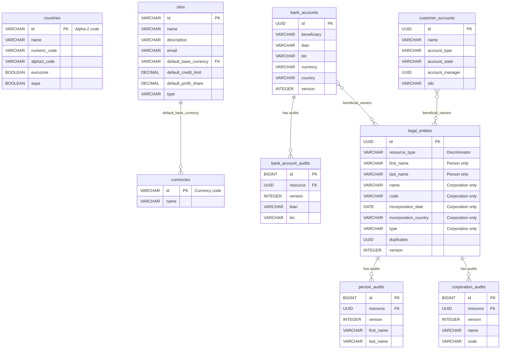

# Payment Service

A Spring Boot 3.2.5 microservice (Java 17) managing state and access to core data entities: countries, currencies, silos, legal entities (people/corporations), bank accounts, and customer accounts.

## Technology Stack

| Layer           | Technology                                  |
|-----------------|---------------------------------------------|
| Language        | Java 17                                     |
| Framework       | Spring Boot 3.2.5                           |
| Database        | H2 (in-memory)                              |
| ORM             | Spring Data JPA / Hibernate                 |
| Migrations      | Flyway                                      |
| DTO Mapping     | MapStruct 1.5.5                             |
| API Spec        | OpenAPI 3.0 (`src/main/resources/openapi.yaml`) |
| Testing         | JUnit 5, Mockito, Spring MockMvc            |
| Build           | Maven 3.9.x                                 |

## Build & Run Instructions

### Prerequisites

- Java 17 or higher
- Maven 3.9.x
- Platform: Windows or Unix-like system

### Building the Project

```bash
# Navigate to project directory
cd c:\AI-Development\AI-Payment-service\payment-service

# Clean and compile
mvn clean compile

# Build the project
mvn clean install -DskipTests

# Run the application
mvn spring-boot:run
```

The application will be available at `http://localhost:8080`

### Accessing H2 Console

- URL: `http://localhost:8080/h2-console`
- JDBC URL: `jdbc:h2:mem:testdb`
- Username: `sa`
- Password: (leave empty)

## Architecture

```
┌──────────────────────────────────────────────────────┐
│                   REST Controllers                    │
│  CoreController · LegalEntitiesController             │
│  BankAccountsController · CustomerAccountsController  │
├──────────────────────────────────────────────────────┤
│                   Service Layer                       │
│  CountryService · CurrencyService · SiloService       │
│  PersonService · CorporationService                   │
│  BankAccountService · CustomerAccountService          │
├──────────────────────────────────────────────────────┤
│               MapStruct Mappers                       │
│  Entity <──────────────────────────> DTO              │
├──────────────────────────────────────────────────────┤
│               Repository Layer                        │
│  Spring Data JPA Repositories                         │
├──────────────────────────────────────────────────────┤
│               Database (H2)                           │
│  Flyway-managed schema + seed data                    │
└──────────────────────────────────────────────────────┘
```

## Project Structure

```
src/main/java/com/techwave/paymentservice/
├── PaymentServiceApplication.java          # Spring Boot entry point
├── controller/                             # REST controllers
│   ├── CoreController.java                 # /countries, /currencies, /silos
│   ├── LegalEntitiesController.java        # /people, /corporations
│   ├── BankAccountsController.java         # /bank-accounts
│   └── CustomerAccountsController.java     # /customer-accounts
├── service/                                # Business logic interfaces
│   ├── impl/                               # Service implementations
│   └── ...Service.java
├── repository/                             # Spring Data JPA repositories
├── entity/                                 # JPA entities
│   ├── LegalEntityBase.java                # Single-table inheritance base
│   ├── PersonEntity.java                   # Discriminator: "people"
│   ├── CorporationEntity.java             # Discriminator: "corporations"
│   └── ...Entity.java
├── dto/                                    # Data Transfer Objects
├── mapper/                                 # MapStruct mappers
└── exception/                              # Global exception handling
    ├── GlobalExceptionHandler.java
    ├── ResourceNotFoundException.java
    └── BadRequestException.java

src/main/resources/
├── application.yml                         # App configuration
├── openapi.yaml                            # OpenAPI 3.0 specification
└── db/migration/
    ├── V1__init_schema.sql                 # Database schema
    └── V2__seed_data.sql                   # Reference data

src/test/java/.../
├── service/                                # Unit tests (Mockito)
│   ├── CountryServiceTest.java
│   ├── PersonServiceTest.java
│   ├── CorporationServiceTest.java
│   └── BankAccountServiceTest.java
└── integration/                            # Integration tests (MockMvc)
    ├── CoreAndLegalEntitiesIntegrationTest.java
    └── AccountsIntegrationTest.java
```

## API Endpoints

### Core (Reference Data)
| Method | Path               | Description                    |
|--------|--------------------|--------------------------------|
| GET    | `/countries`       | List all countries             |
| GET    | `/countries/{id}`  | Get country by Alpha-2 code   |
| GET    | `/currencies`      | List all currencies            |
| GET    | `/currencies/{id}` | Get currency by code           |
| GET    | `/silos`           | List all silos                 |
| GET    | `/silos/{id}`      | Get silo by id                 |

### Legal Entities
| Method | Path                                 | Description                         |
|--------|--------------------------------------|-------------------------------------|
| POST   | `/people`                            | Create a person                     |
| GET    | `/people/{uuid}`                     | Get person by UUID                  |
| PATCH  | `/people/{uuid}`                     | Update person (partial)             |
| GET    | `/people/{uuid}/audit-trail`         | Person audit history                |
| POST   | `/corporations`                      | Create a corporation                |
| GET    | `/corporations/{uuid}`               | Get corporation by UUID             |
| PATCH  | `/corporations/{uuid}`               | Update corporation (partial)        |
| GET    | `/corporations/{uuid}/audit-trail`   | Corporation audit history           |
| GET    | `/corporations/{country}/{code}`     | Get corporation by country and code |

### Bank Accounts
| Method | Path                                          | Description                  |
|--------|-----------------------------------------------|------------------------------|
| PUT    | `/bank-accounts`                              | Create or locate account     |
| GET    | `/bank-accounts/{uuid}`                       | Get account by UUID          |
| GET    | `/bank-accounts/{uuid}/audit-trail`           | Account audit history        |
| GET    | `/bank-accounts/{uuid}/beneficial-owners`     | List beneficial owners       |

### Customer Accounts
| Method | Path                                              | Description              |
|--------|---------------------------------------------------|--------------------------|
| GET    | `/customer-accounts/{uuid}`                       | Get account by UUID      |
| GET    | `/customer-accounts/{uuid}/beneficial-owners`     | List beneficial owners   |

## Database Schema (ER Diagram)



## Build & Run

```bash
# Build the project
mvn clean install

# Run the application
mvn spring-boot:run

# Run tests only
mvn test
```

The application starts on **http://localhost:8080**.
The H2 Console is available at **http://localhost:8080/h2-console** (JDBC URL: `jdbc:h2:mem:paymentdb`).

## Error Handling

All errors follow the `ExceptionDetail` schema from the OpenAPI spec:

```json
{
  "status": 404,
  "error": "Not Found",
  "message": "Country not found with id: ZZ",
  "messages": []
}
```

| HTTP Status | Scenario                              |
|-------------|---------------------------------------|
| 400         | Validation errors, bad request        |
| 404         | Resource not found                    |
| 405         | HTTP method not allowed               |
| 500         | Unexpected server error               |

