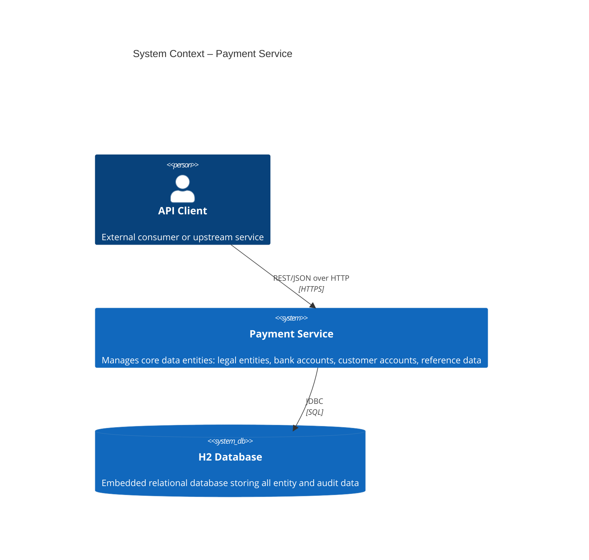
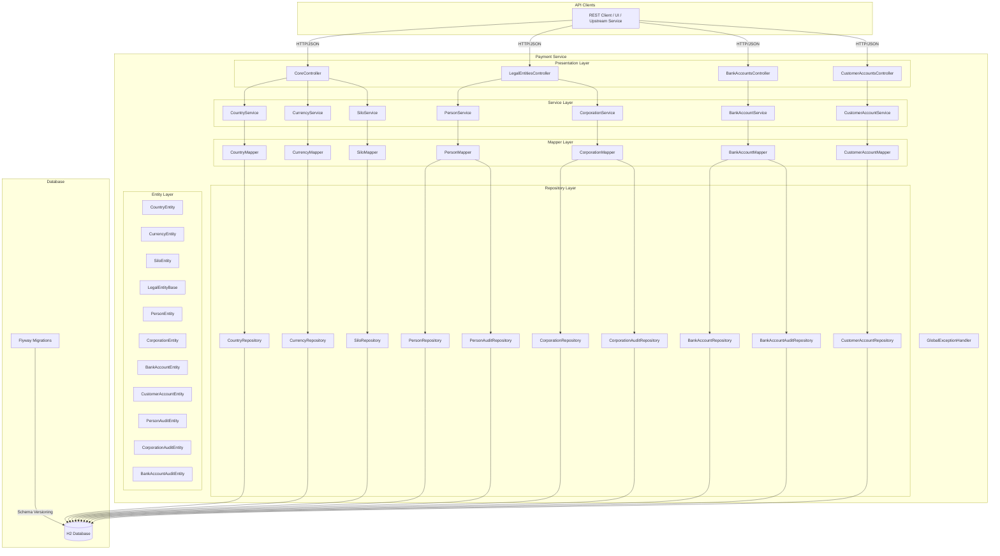
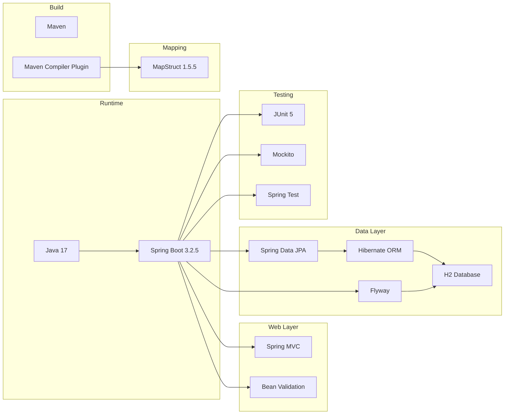
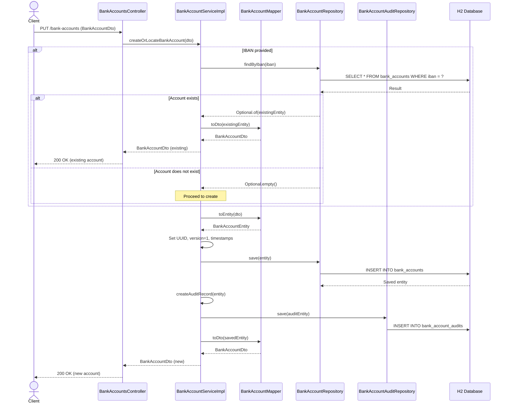
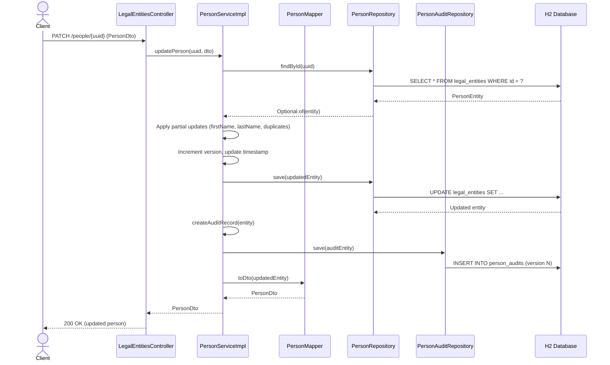
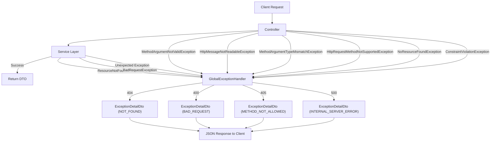
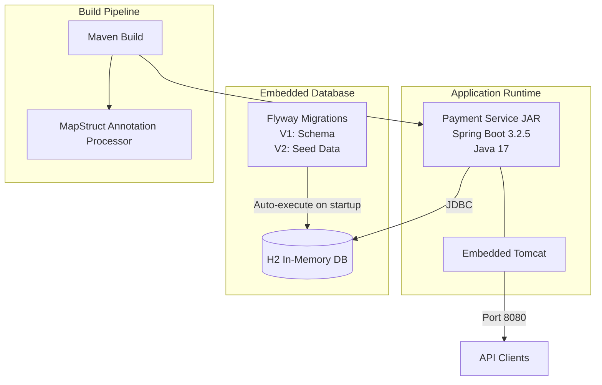

# Payment Service – High-Level Design (HLD)

## 1. Overview

The **Payment Service** is a Spring Boot 3.2.5 microservice that manages core data entities for a payment processing platform. It provides RESTful APIs for managing reference data (countries, currencies, silos), legal entities (people and corporations), bank accounts, and customer accounts. The service follows a layered architecture with full audit trail support, idempotent operations, and centralized error handling.

| Attribute             | Value                               |
|-----------------------|-------------------------------------|
| Framework             | Spring Boot 3.2.5                   |
| Language              | Java 17                             |
| Build Tool            | Maven                               |
| Database              | H2 (embedded, runtime)              |
| ORM                   | Spring Data JPA / Hibernate         |
| Migration             | Flyway                              |
| DTO Mapping           | MapStruct 1.5.5                     |
| API Specification     | OpenAPI 3.0                         |

---

## 2. System Context Diagram

---

## 3. High-Level Architecture Diagram

---

## 4. API Endpoint Summary

### 4.1 Core Endpoints (Reference Data)

| Method | Path               | Operation        | Description                 |
|--------|--------------------|------------------|-----------------------------|
| GET    | `/countries`       | getCountries     | Retrieve all countries      |
| GET    | `/countries/{id}`  | getCountry       | Retrieve country by code    |
| GET    | `/currencies`      | getCurrencies    | Retrieve all currencies     |
| GET    | `/currencies/{id}` | getCurrency      | Retrieve currency by code   |
| GET    | `/silos`           | getSilos         | Retrieve all silos          |
| GET    | `/silos/{id}`      | getSilo          | Retrieve silo by ID         |

### 4.2 Legal Entity Endpoints

| Method | Path                                 | Operation               | Description                           |
|--------|--------------------------------------|-------------------------|---------------------------------------|
| POST   | `/people`                            | createPerson            | Create a new person                   |
| GET    | `/people/{uuid}`                     | getPerson               | Retrieve person by UUID               |
| PATCH  | `/people/{uuid}`                     | updatePerson            | Partial update of a person            |
| GET    | `/people/{uuid}/audit-trail`         | getPersonAuditTrail     | Person version history                |
| POST   | `/corporations`                      | createCorporation       | Create a new corporation              |
| GET    | `/corporations/{uuid}`               | getCorporation          | Retrieve corporation by UUID          |
| PATCH  | `/corporations/{uuid}`               | updateCorporation       | Partial update of a corporation       |
| GET    | `/corporations/{uuid}/audit-trail`   | getCorporationAuditTrail| Corporation version history            |
| GET    | `/corporations/{country}/{code}`     | getCorporationByCode    | Retrieve corporation by country+code  |

### 4.3 Bank Account Endpoints

| Method | Path                                          | Operation                      | Description                       |
|--------|-----------------------------------------------|--------------------------------|-----------------------------------|
| PUT    | `/bank-accounts`                              | createBankAccount              | Create or locate (idempotent)     |
| GET    | `/bank-accounts/{uuid}`                       | getBankAccount                 | Retrieve bank account by UUID     |
| GET    | `/bank-accounts/{uuid}/audit-trail`           | getBankAccountAuditTrail       | Bank account version history      |
| GET    | `/bank-accounts/{uuid}/beneficial-owners`     | getBankAccountBeneficialOwners | Beneficial owners for the account |

### 4.4 Customer Account Endpoints

| Method | Path                                               | Operation                          | Description                       |
|--------|----------------------------------------------------|------------------------------------|-----------------------------------|
| GET    | `/customer-accounts/{uuid}`                        | getCustomerAccount                 | Retrieve customer account by UUID |
| GET    | `/customer-accounts/{uuid}/beneficial-owners`      | getCustomerAccountBeneficialOwners | Beneficial owners for the account |

---

## 5. Technology Stack Diagram

---

## 6. Data Flow – Create Bank Account (Idempotent PUT)

---

## 7. Data Flow – Update Person with Audit Trail

---

## 8. Exception Handling Flow

---

## 9. Deployment Architecture

---

## 10. Key Design Decisions

| Decision                        | Rationale                                                                 |
|---------------------------------|---------------------------------------------------------------------------|
| Single-Table Inheritance        | `legal_entities` table stores both Person and Corporation via `resource_type` discriminator, simplifying queries and joins |
| Idempotent Bank Account Create  | PUT on `/bank-accounts` uses IBAN as natural key; returns existing if found, preventing duplicate records |
| Version-Based Audit Trail       | Every mutation creates an audit record with an incremented version number for full traceability |
| MapStruct for DTO Mapping       | Compile-time code generation avoids runtime reflection overhead and catches mapping errors at build time |
| Flyway for Migrations           | Versioned SQL scripts ensure reproducible schema evolution across environments |
| Centralized Exception Handling  | `@RestControllerAdvice` provides consistent `ExceptionDetailDto` responses for all error scenarios |
| Many-to-Many Beneficial Owners  | Junction tables link both bank accounts and customer accounts to legal entities (Person/Corporation) |
| H2 Embedded Database            | Simplifies development and testing; easily replaceable with PostgreSQL/MySQL for production |

---

## 11. Non-Functional Considerations

- **Scalability**: Stateless REST service behind a load balancer; database is the bottleneck (swap H2 for production DB)
- **Security**: Input validation via Bean Validation; OWASP-aligned exception handling; parameterized queries via JPA
- **Observability**: SLF4J logging at controller and service layers with contextual UUIDs
- **Maintainability**: Layered architecture with clear separation of concerns; MapStruct eliminates manual mapping code
- **Data Integrity**: `@Transactional` boundaries on service methods; audit records within the same transaction as data mutations
