# Payment Service – Low-Level Design (LLD)

## 1. Package Structure

```
com.techwave.paymentservice
├── PaymentServiceApplication.java          # Spring Boot entry point
├── controller/
│   ├── CoreController.java                 # Countries, Currencies, Silos
│   ├── LegalEntitiesController.java        # People, Corporations
│   ├── BankAccountsController.java         # Bank Accounts
│   └── CustomerAccountsController.java     # Customer Accounts
├── dto/
│   ├── CountryDto.java
│   ├── CurrencyDto.java
│   ├── SiloDto.java
│   ├── PersonDto.java
│   ├── CorporationDto.java
│   ├── LegalEntityDto.java                 # Discriminated base DTO
│   ├── BankAccountDto.java
│   ├── CustomerAccountDto.java
│   ├── PersonAuditDto.java
│   ├── CorporationAuditDto.java
│   ├── BankAccountAuditDto.java
│   └── ExceptionDetailDto.java
├── entity/
│   ├── LegalEntityBase.java                # Abstract, single-table inheritance
│   ├── PersonEntity.java                   # @DiscriminatorValue("people")
│   ├── CorporationEntity.java             # @DiscriminatorValue("corporations")
│   ├── BankAccountEntity.java
│   ├── CustomerAccountEntity.java
│   ├── CountryEntity.java
│   ├── CurrencyEntity.java
│   ├── SiloEntity.java
│   ├── SiloType.java                       # Enum
│   ├── CustomerAccountType.java            # Enum
│   ├── CustomerAccountState.java           # Enum
│   ├── PersonAuditEntity.java
│   ├── CorporationAuditEntity.java
│   └── BankAccountAuditEntity.java
├── exception/
│   ├── ResourceNotFoundException.java
│   ├── BadRequestException.java
│   └── GlobalExceptionHandler.java         # @RestControllerAdvice
├── mapper/
│   ├── CountryMapper.java
│   ├── CurrencyMapper.java
│   ├── SiloMapper.java
│   ├── PersonMapper.java
│   ├── CorporationMapper.java
│   ├── BankAccountMapper.java
│   └── CustomerAccountMapper.java
├── repository/
│   ├── CountryRepository.java
│   ├── CurrencyRepository.java
│   ├── SiloRepository.java
│   ├── PersonRepository.java
│   ├── CorporationRepository.java
│   ├── BankAccountRepository.java
│   ├── CustomerAccountRepository.java
│   ├── PersonAuditRepository.java
│   ├── CorporationAuditRepository.java
│   └── BankAccountAuditRepository.java
└── service/
    ├── CountryService.java
    ├── CurrencyService.java
    ├── SiloService.java
    ├── PersonService.java
    ├── CorporationService.java
    ├── BankAccountService.java
    ├── CustomerAccountService.java
    └── impl/
        ├── CountryServiceImpl.java
        ├── CurrencyServiceImpl.java
        ├── SiloServiceImpl.java
        ├── PersonServiceImpl.java
        ├── CorporationServiceImpl.java
        ├── BankAccountServiceImpl.java
        └── CustomerAccountServiceImpl.java
```

---

## 2. Entity-Relationship Diagram

```mermaid
erDiagram
    countries {
        VARCHAR2 id PK "Alpha-2 code"
        VARCHAR name "Country name"
        VARCHAR3 numeric_code "ISO numeric"
        VARCHAR3 alpha3_code "ISO alpha-3"
        BOOLEAN eurozone
        BOOLEAN sepa
    }

    currencies {
        VARCHAR3 id PK "ISO 4217 code"
        VARCHAR name "Currency name"
    }

    silos {
        VARCHAR100 id PK
        VARCHAR name
        VARCHAR1000 description
        VARCHAR email
        VARCHAR3 default_base_currency FK
        DECIMAL default_credit_limit
        DECIMAL default_profit_share
        VARCHAR50 type "TREASURY|BUSINESS_UNIT|SUBSIDIARY|AGENT"
    }

    legal_entities {
        UUID id PK
        VARCHAR50 resource_type "Discriminator: people|corporations"
        VARCHAR first_name "Person only"
        VARCHAR last_name "Person only"
        VARCHAR name "Corporation only"
        VARCHAR100 code "Corporation only"
        DATE incorporation_date "Corporation only"
        VARCHAR2 incorporation_country "Corporation only"
        VARCHAR100 type "Corporation only"
        UUID duplicates
        INTEGER version
        TIMESTAMP created_at
        TIMESTAMP updated_at
    }

    bank_accounts {
        UUID id PK
        VARCHAR beneficiary
        VARCHAR500 beneficiary_address
        VARCHAR nickname
        VARCHAR34 iban
        VARCHAR11 bic
        VARCHAR50 account_number
        VARCHAR50 national_bank_code
        VARCHAR50 national_branch_code
        VARCHAR50 national_clearing_code
        VARCHAR3 currency
        VARCHAR2 country
        INTEGER version
        TIMESTAMP created_at
        TIMESTAMP updated_at
    }

    customer_accounts {
        UUID id PK
        VARCHAR name
        VARCHAR1000 description
        VARCHAR50 account_type "Enum"
        VARCHAR50 account_state "Enum"
        UUID account_manager
        TIMESTAMP account_creation_time
        VARCHAR100 silo
        TIMESTAMP created_at
        TIMESTAMP updated_at
    }

    person_audits {
        BIGINT id PK "Auto-increment"
        UUID resource FK
        INTEGER version
        VARCHAR first_name
        VARCHAR last_name
        UUID duplicates
        TIMESTAMP created_at
    }

    corporation_audits {
        BIGINT id PK "Auto-increment"
        UUID resource FK
        INTEGER version
        VARCHAR name
        VARCHAR100 code
        DATE incorporation_date
        VARCHAR2 incorporation_country
        VARCHAR100 type
        UUID duplicates
        TIMESTAMP created_at
    }

    bank_account_audits {
        BIGINT id PK "Auto-increment"
        UUID resource FK
        INTEGER version
        VARCHAR beneficiary
        VARCHAR500 beneficiary_address
        VARCHAR nickname
        VARCHAR34 iban
        VARCHAR11 bic
        VARCHAR50 account_number
        VARCHAR50 national_bank_code
        VARCHAR50 national_branch_code
        VARCHAR50 national_clearing_code
        VARCHAR3 currency
        VARCHAR2 country
        TIMESTAMP created_at
    }

    bank_account_beneficial_owners {
        UUID bank_account_id PK_FK
        UUID legal_entity_id PK_FK
    }

    customer_account_beneficial_owners {
        UUID customer_account_id PK_FK
        UUID legal_entity_id PK_FK
    }

    silos ||--o{ currencies : "default_base_currency"
    legal_entities ||--o{ person_audits : "resource"
    legal_entities ||--o{ corporation_audits : "resource"
    bank_accounts ||--o{ bank_account_audits : "resource"
    bank_accounts ||--|{ bank_account_beneficial_owners : "bank_account_id"
    legal_entities ||--|{ bank_account_beneficial_owners : "legal_entity_id"
    customer_accounts ||--|{ customer_account_beneficial_owners : "customer_account_id"
    legal_entities ||--|{ customer_account_beneficial_owners : "legal_entity_id"
```

---

## 3. Class Diagrams

### 3.1 Entity Layer – Inheritance Hierarchy

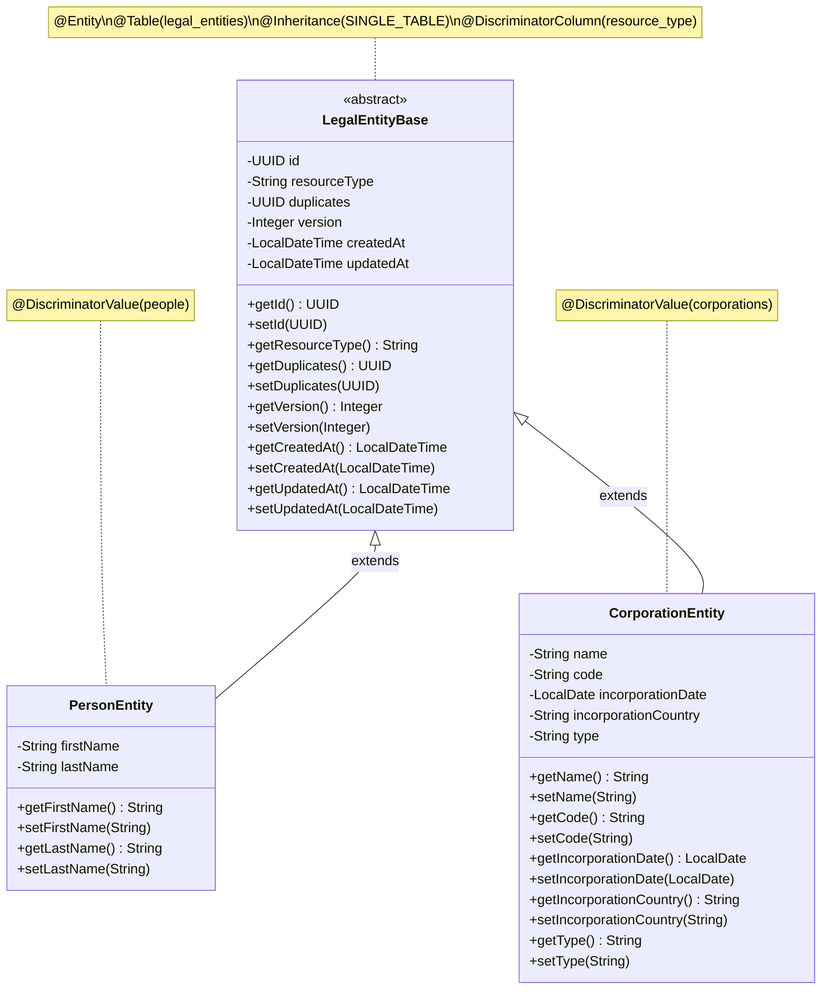

### 3.2 Entity Layer – Accounts and Relationships

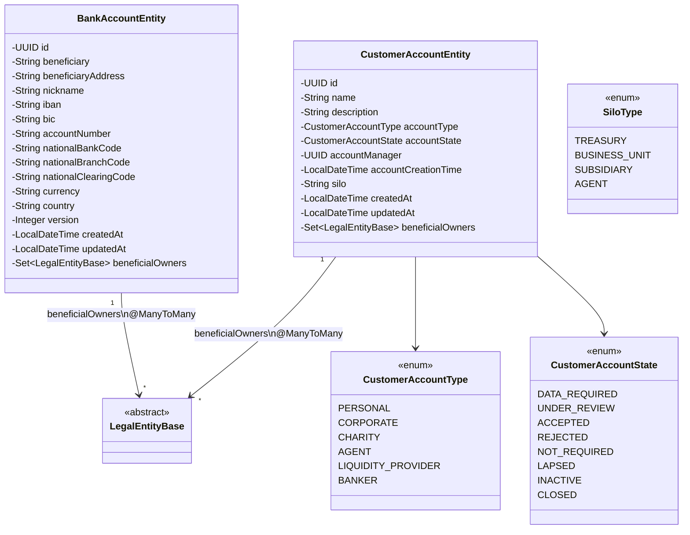

### 3.3 Entity Layer – Reference Data

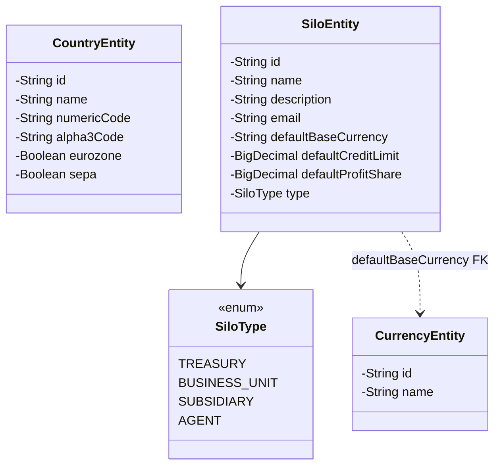

### 3.4 Entity Layer – Audit Entities

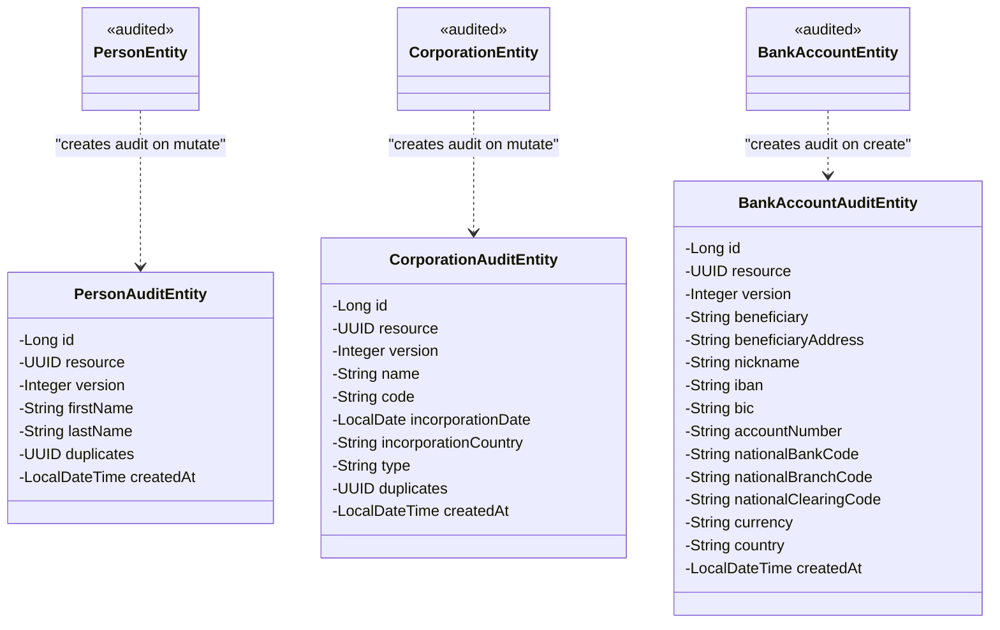

### 3.5 Service Layer

```mermaid
classDiagram
    class CountryService {
        <<interface>>
        +getAllCountries() List~CountryDto~
        +getCountryById(String id) CountryDto
    }

    class CurrencyService {
        <<interface>>
        +getAllCurrencies() List~CurrencyDto~
        +getCurrencyById(String id) CurrencyDto
    }

    class SiloService {
        <<interface>>
        +getAllSilos() List~SiloDto~
        +getSiloById(String id) SiloDto
    }

    class PersonService {
        <<interface>>
        +createPerson(PersonDto) PersonDto
        +getPersonById(UUID) PersonDto
        +updatePerson(UUID, PersonDto) PersonDto
        +getAuditTrail(UUID) List~PersonAuditDto~
    }

    class CorporationService {
        <<interface>>
        +createCorporation(CorporationDto) CorporationDto
        +getCorporationById(UUID) CorporationDto
        +updateCorporation(UUID, CorporationDto) CorporationDto
        +getAuditTrail(UUID) List~CorporationAuditDto~
        +getCorporationByCode(String, String) CorporationDto
    }

    class BankAccountService {
        <<interface>>
        +createOrLocateBankAccount(BankAccountDto) BankAccountDto
        +getBankAccountById(UUID) BankAccountDto
        +getAuditTrail(UUID) List~BankAccountAuditDto~
        +getBeneficialOwners(UUID) List~LegalEntityDto~
    }

    class CustomerAccountService {
        <<interface>>
        +getCustomerAccountById(UUID) CustomerAccountDto
        +getBeneficialOwners(UUID) List~LegalEntityDto~
    }

    class CountryServiceImpl {
        -CountryRepository countryRepository
        -CountryMapper countryMapper
    }
    class CurrencyServiceImpl {
        -CurrencyRepository currencyRepository
        -CurrencyMapper currencyMapper
    }
    class SiloServiceImpl {
        -SiloRepository siloRepository
        -SiloMapper siloMapper
    }
    class PersonServiceImpl {
        -PersonRepository personRepository
        -PersonAuditRepository personAuditRepository
        -PersonMapper personMapper
    }
    class CorporationServiceImpl {
        -CorporationRepository corporationRepository
        -CorporationAuditRepository corporationAuditRepository
        -CorporationMapper corporationMapper
    }
    class BankAccountServiceImpl {
        -BankAccountRepository bankAccountRepository
        -BankAccountAuditRepository bankAccountAuditRepository
        -BankAccountMapper bankAccountMapper
    }
    class CustomerAccountServiceImpl {
        -CustomerAccountRepository customerAccountRepository
        -CustomerAccountMapper customerAccountMapper
    }

    CountryService <|.. CountryServiceImpl
    CurrencyService <|.. CurrencyServiceImpl
    SiloService <|.. SiloServiceImpl
    PersonService <|.. PersonServiceImpl
    CorporationService <|.. CorporationServiceImpl
    BankAccountService <|.. BankAccountServiceImpl
    CustomerAccountService <|.. CustomerAccountServiceImpl
```

### 3.6 Controller Layer

```mermaid
classDiagram
    class CoreController {
        -CountryService countryService
        -CurrencyService currencyService
        -SiloService siloService
        +getCountries() ResponseEntity~List~CountryDto~~
        +getCountry(String id) ResponseEntity~CountryDto~
        +getCurrencies() ResponseEntity~List~CurrencyDto~~
        +getCurrency(String id) ResponseEntity~CurrencyDto~
        +getSilos() ResponseEntity~List~SiloDto~~
        +getSilo(String id) ResponseEntity~SiloDto~
    }

    class LegalEntitiesController {
        -PersonService personService
        -CorporationService corporationService
        +createPerson(PersonDto) ResponseEntity~PersonDto~
        +getPerson(UUID) ResponseEntity~PersonDto~
        +updatePerson(UUID, PersonDto) ResponseEntity~PersonDto~
        +getPersonAuditTrail(UUID) ResponseEntity~List~PersonAuditDto~~
        +createCorporation(CorporationDto) ResponseEntity~CorporationDto~
        +getCorporation(UUID) ResponseEntity~CorporationDto~
        +updateCorporation(UUID, CorporationDto) ResponseEntity~CorporationDto~
        +getCorporationAuditTrail(UUID) ResponseEntity~List~CorporationAuditDto~~
        +getCorporationByCode(String, String) ResponseEntity~CorporationDto~
    }

    class BankAccountsController {
        -BankAccountService bankAccountService
        +createBankAccount(BankAccountDto) ResponseEntity~BankAccountDto~
        +getBankAccount(UUID) ResponseEntity~BankAccountDto~
        +getBankAccountAuditTrail(UUID) ResponseEntity~List~BankAccountAuditDto~~
        +getBankAccountBeneficialOwners(UUID) ResponseEntity~List~LegalEntityDto~~
    }

    class CustomerAccountsController {
        -CustomerAccountService customerAccountService
        +getCustomerAccount(UUID) ResponseEntity~CustomerAccountDto~
        +getCustomerAccountBeneficialOwners(UUID) ResponseEntity~List~LegalEntityDto~~
    }

    CoreController --> CountryService
    CoreController --> CurrencyService
    CoreController --> SiloService
    LegalEntitiesController --> PersonService
    LegalEntitiesController --> CorporationService
    BankAccountsController --> BankAccountService
    CustomerAccountsController --> CustomerAccountService

    note for CoreController "@RestController"
    note for LegalEntitiesController "@RestController"
    note for BankAccountsController "@RestController"
    note for CustomerAccountsController "@RestController"
```

### 3.7 Repository Layer

```mermaid
classDiagram
    class JpaRepository~T_ID~ {
        <<interface>>
        +findById(ID) Optional~T~
        +findAll() List~T~
        +save(T) T
        +existsById(ID) boolean
        +deleteById(ID)
    }

    class CountryRepository {
        <<interface>>
    }
    class CurrencyRepository {
        <<interface>>
    }
    class SiloRepository {
        <<interface>>
    }
    class PersonRepository {
        <<interface>>
    }
    class CorporationRepository {
        <<interface>>
        +findByIncorporationCountryAndCode(String, String) Optional~CorporationEntity~
    }
    class BankAccountRepository {
        <<interface>>
        +findByIban(String) Optional~BankAccountEntity~
    }
    class CustomerAccountRepository {
        <<interface>>
    }
    class PersonAuditRepository {
        <<interface>>
        +findByResourceOrderByVersionAsc(UUID) List~PersonAuditEntity~
    }
    class CorporationAuditRepository {
        <<interface>>
        +findByResourceOrderByVersionAsc(UUID) List~CorporationAuditEntity~
    }
    class BankAccountAuditRepository {
        <<interface>>
        +findByResourceOrderByVersionAsc(UUID) List~BankAccountAuditEntity~
    }

    JpaRepository <|-- CountryRepository : "~CountryEntity, String~"
    JpaRepository <|-- CurrencyRepository : "~CurrencyEntity, String~"
    JpaRepository <|-- SiloRepository : "~SiloEntity, String~"
    JpaRepository <|-- PersonRepository : "~PersonEntity, UUID~"
    JpaRepository <|-- CorporationRepository : "~CorporationEntity, UUID~"
    JpaRepository <|-- BankAccountRepository : "~BankAccountEntity, UUID~"
    JpaRepository <|-- CustomerAccountRepository : "~CustomerAccountEntity, UUID~"
    JpaRepository <|-- PersonAuditRepository : "~PersonAuditEntity, Long~"
    JpaRepository <|-- CorporationAuditRepository : "~CorporationAuditEntity, Long~"
    JpaRepository <|-- BankAccountAuditRepository : "~BankAccountAuditEntity, Long~"
```

### 3.8 Mapper Layer

```mermaid
classDiagram
    class PersonMapper {
        <<interface>>
        +toDto(PersonEntity) PersonDto
        +toEntity(PersonDto) PersonEntity
        +updateEntity(PersonDto, PersonEntity) void
        +toAuditDto(PersonAuditEntity) PersonAuditDto
        +toAuditDtoList(List~PersonAuditEntity~) List~PersonAuditDto~
    }

    class CorporationMapper {
        <<interface>>
        +toDto(CorporationEntity) CorporationDto
        +toEntity(CorporationDto) CorporationEntity
        +updateEntity(CorporationDto, CorporationEntity) void
        +toAuditDto(CorporationAuditEntity) CorporationAuditDto
        +toAuditDtoList(List~CorporationAuditEntity~) List~CorporationAuditDto~
    }

    class BankAccountMapper {
        <<interface>>
        +toDto(BankAccountEntity) BankAccountDto
        +toEntity(BankAccountDto) BankAccountEntity
        +toAuditDto(BankAccountAuditEntity) BankAccountAuditDto
        +toAuditDtoList(List~BankAccountAuditEntity~) List~BankAccountAuditDto~
        +toLegalEntityDto(LegalEntityBase) LegalEntityDto
        +toLegalEntityDtoList(Set~LegalEntityBase~) List~LegalEntityDto~
    }

    class CustomerAccountMapper {
        <<interface>>
        +toDto(CustomerAccountEntity) CustomerAccountDto
        +toLegalEntityDto(LegalEntityBase) LegalEntityDto
        +toLegalEntityDtoList(Set~LegalEntityBase~) List~LegalEntityDto~
    }

    class CountryMapper {
        <<interface>>
        +toDto(CountryEntity) CountryDto
        +toDtoList(List~CountryEntity~) List~CountryDto~
    }

    class CurrencyMapper {
        <<interface>>
        +toDto(CurrencyEntity) CurrencyDto
        +toDtoList(List~CurrencyEntity~) List~CurrencyDto~
    }

    class SiloMapper {
        <<interface>>
        +toDto(SiloEntity) SiloDto
        +toDtoList(List~SiloEntity~) List~SiloDto~
    }

    note for PersonMapper "@Mapper(componentModel=spring)\nNullValuePropertyMappingStrategy.IGNORE"
    note for BankAccountMapper "@Mapper(componentModel=spring)\nNullValuePropertyMappingStrategy.IGNORE"
```

### 3.9 Exception Handling

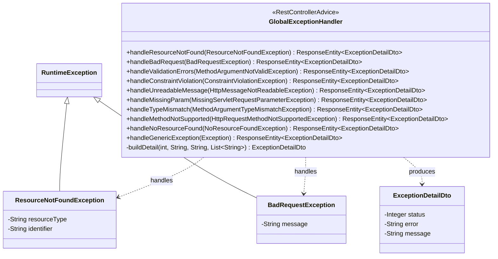

---

## 4. Detailed Sequence Diagrams

### 4.1 Create Person

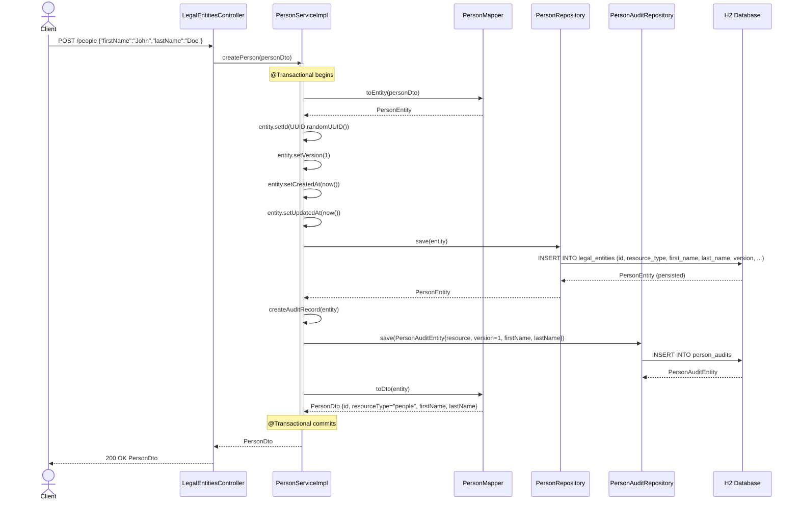

### 4.2 Update Corporation with Audit

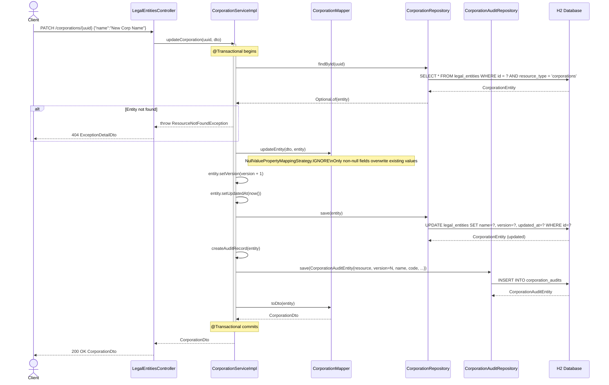

### 4.3 Idempotent Bank Account Create-or-Locate

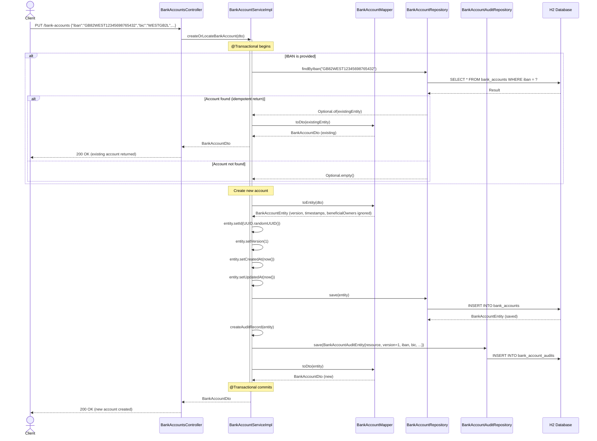

### 4.4 Retrieve Beneficial Owners

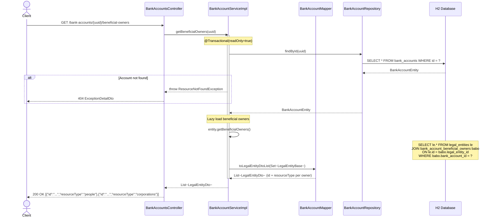

### 4.5 Get Audit Trail

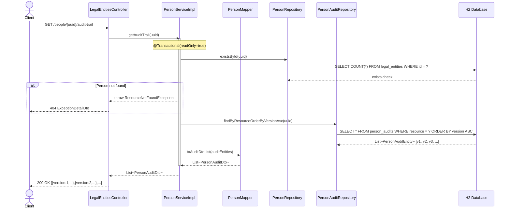

---

## 5. Exception Handling Flow

```mermaid
flowchart TB
    REQ[Incoming HTTP Request] --> CTRL[Controller Method]

    CTRL --> SVC[Service Layer]

    SVC -->|Success| DTO[Return DTO in ResponseEntity 200]
    SVC -->|Entity not found| RNF[throw ResourceNotFoundException]
    SVC -->|Invalid request| BRE[throw BadRequestException]

    CTRL -->|Invalid UUID format| TM[MethodArgumentTypeMismatchException]
    CTRL -->|Malformed JSON| MNR[HttpMessageNotReadableException]
    CTRL -->|@Valid fails| MNV[MethodArgumentNotValidException]
    CTRL -->|@Validated fails| CV[ConstraintViolationException]
    CTRL -->|Wrong HTTP method| MNS[HttpRequestMethodNotSupportedException]
    CTRL -->|No route match| NRF[NoResourceFoundException]
    CTRL -->|Unexpected| GEN[Exception]

    RNF --> GEH[GlobalExceptionHandler]
    BRE --> GEH
    TM --> GEH
    MNR --> GEH
    MNV --> GEH
    CV --> GEH
    MNS --> GEH
    NRF --> GEH
    GEN --> GEH

    GEH -->|ResourceNotFoundException| R404["404 Not Found\nExceptionDetailDto"]
    GEH -->|BadRequestException| R400a["400 Bad Request\nExceptionDetailDto"]
    GEH -->|MethodArgumentNotValidException| R400b["400 Bad Request\nExceptionDetailDto + field errors"]
    GEH -->|ConstraintViolationException| R400c["400 Bad Request\nExceptionDetailDto + violations"]
    GEH -->|HttpMessageNotReadableException| R400d["400 Bad Request\nMalformed body"]
    GEH -->|MissingServletRequestParameterException| R400e["400 Bad Request\nMissing param"]
    GEH -->|MethodArgumentTypeMismatchException| R400f["400 Bad Request\nType mismatch"]
    GEH -->|HttpRequestMethodNotSupportedException| R405["405 Method Not Allowed"]
    GEH -->|NoResourceFoundException| R404b["404 Not Found"]
    GEH -->|Exception catch-all| R500["500 Internal Server Error"]
```

---

## 6. Database Migration Strategy

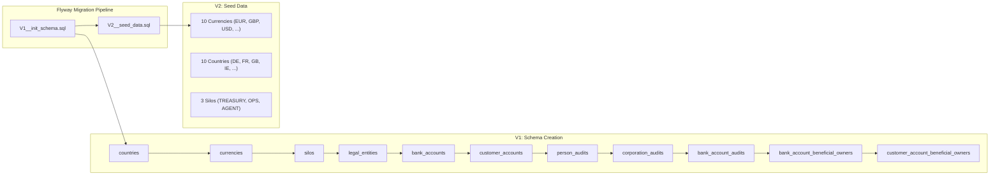

---

## 7. Dependency Injection Wiring

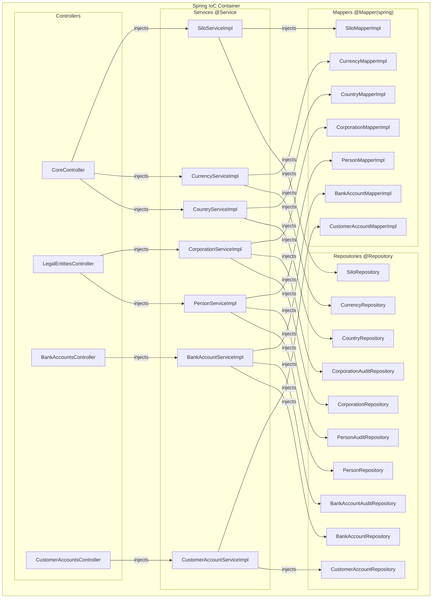

---

## 8. Audit Trail Design Pattern

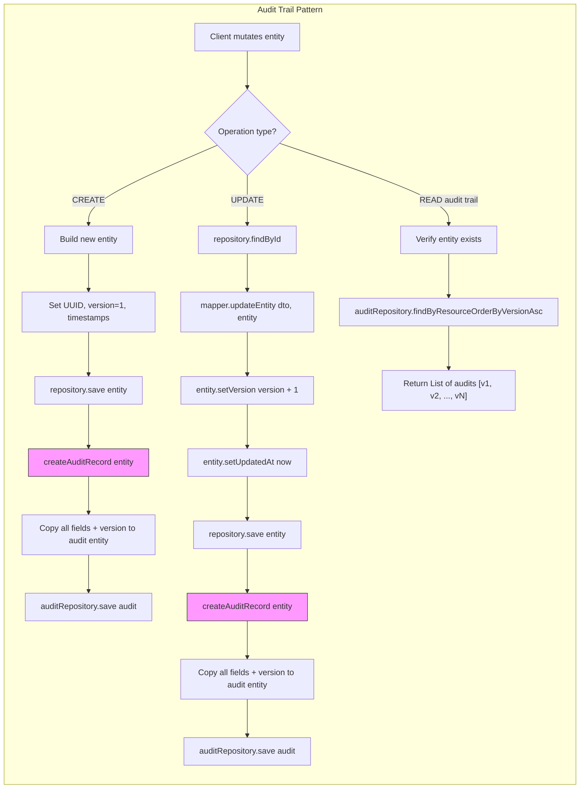

---

## 9. MapStruct Mapping Strategy

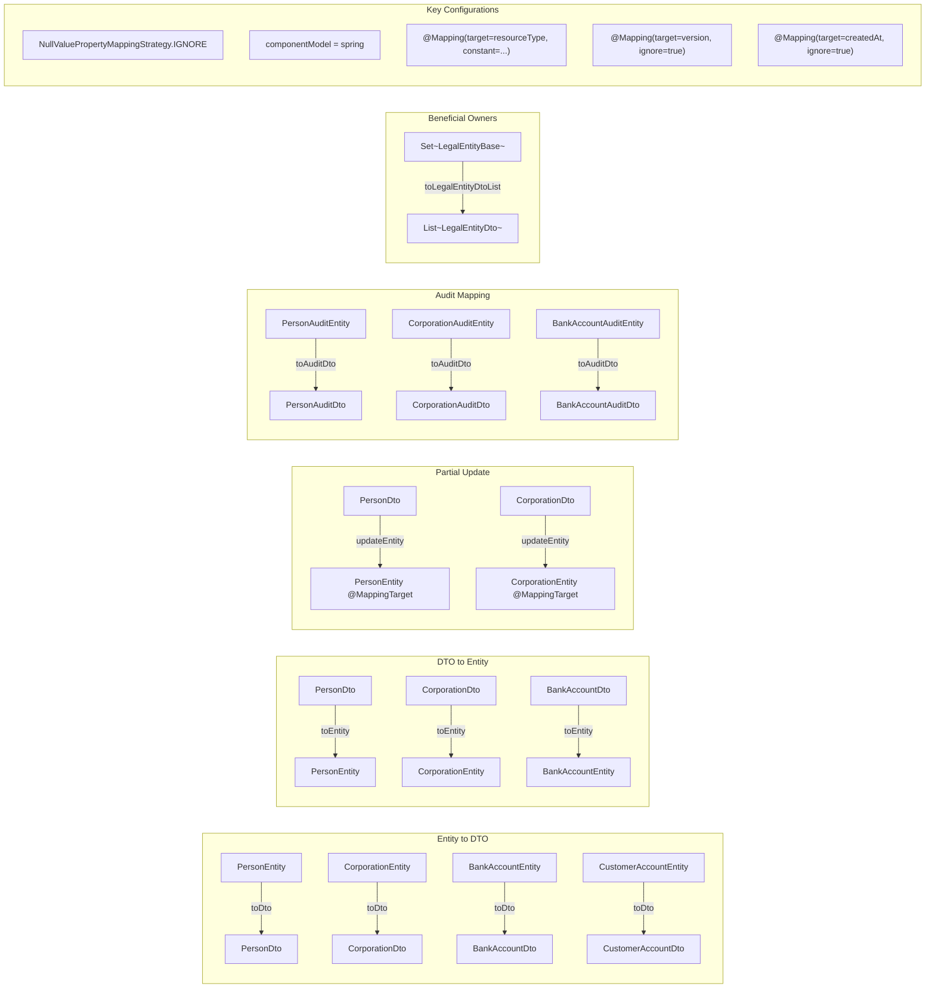

---

## 10. Request/Response Mapping Table

### 10.1 Entity → DTO Field Mappings

| Entity Field              | DTO Field            | Mapping Notes                                   |
|---------------------------|----------------------|-------------------------------------------------|
| `PersonEntity.id`         | `PersonDto.id`       | Direct mapping (UUID)                           |
| —                         | `PersonDto.resourceType` | Constant: `"people"`                         |
| `PersonEntity.firstName`  | `PersonDto.firstName`| Direct                                          |
| `PersonEntity.lastName`   | `PersonDto.lastName` | Direct                                          |
| `PersonEntity.duplicates` | `PersonDto.duplicates`| Direct (UUID)                                  |
| `CorporationEntity.id`   | `CorporationDto.id`  | Direct (UUID)                                   |
| —                         | `CorporationDto.resourceType` | Constant: `"corporations"`            |
| `CorporationEntity.name` | `CorporationDto.name`| Direct                                          |
| `CorporationEntity.code` | `CorporationDto.code`| Direct                                          |
| `CorporationEntity.incorporationDate` | `CorporationDto.incorporationDate` | LocalDate → String (date format) |
| `CorporationEntity.incorporationCountry` | `CorporationDto.incorporationCountry` | Direct       |
| `BankAccountEntity.id`   | `BankAccountDto.id`   | Direct (UUID)                                   |
| —                         | `BankAccountDto.resourceType` | Constant: `"bank-accounts"`          |
| `BankAccountEntity.iban`  | `BankAccountDto.iban` | Direct                                          |
| `BankAccountEntity.bic`   | `BankAccountDto.bic`  | Direct                                          |
| `SiloEntity.type`         | `SiloDto.type`        | Enum `SiloType` → String                       |
| `CustomerAccountEntity.accountType` | `CustomerAccountDto.accountType` | Enum → String      |
| `CustomerAccountEntity.accountState` | `CustomerAccountDto.accountState` | Enum → String     |

### 10.2 Ignored Fields (DTO → Entity)

| Field           | Direction       | Reason                                |
|-----------------|-----------------|---------------------------------------|
| `version`       | DTO → Entity    | Managed by service layer              |
| `createdAt`     | DTO → Entity    | Set programmatically on create        |
| `updatedAt`     | DTO → Entity    | Set programmatically on create/update |
| `id`            | DTO → Entity (update) | Immutable primary key           |
| `resourceType`  | DTO → Entity    | JPA discriminator, not writable       |
| `beneficialOwners` | DTO → Entity | Managed separately through junction tables |

---

## 11. Database Index Strategy

| Table              | Index Name                        | Columns                          | Purpose                                       |
|--------------------|-----------------------------------|----------------------------------|-----------------------------------------------|
| `legal_entities`   | `idx_legal_entities_resource_type`| `resource_type`                  | Filter by entity type (Person vs Corporation) |
| `legal_entities`   | `idx_corporation_country_code`    | `incorporation_country, code`    | Lookup corporation by country + company code  |
| `person_audits`    | `idx_person_audits_resource`      | `resource`                       | Fast audit trail lookup by person UUID        |
| `corporation_audits` | `idx_corporation_audits_resource`| `resource`                       | Fast audit trail lookup by corporation UUID   |
| `bank_account_audits` | `idx_bank_account_audits_resource`| `resource`                     | Fast audit trail lookup by bank account UUID  |

---

## 12. Transaction Boundaries

| Service Method                          | Transaction Type    | Description                                                    |
|-----------------------------------------|--------------------|-----------------------------------------------------------------|
| `createPerson()`                        | `@Transactional`   | Insert entity + insert audit in same transaction               |
| `updatePerson()`                        | `@Transactional`   | Update entity + insert audit in same transaction               |
| `getPersonById()`                       | `readOnly = true`  | Read-only, no write lock                                       |
| `getAuditTrail()` (Person)              | `readOnly = true`  | Read-only, no write lock                                       |
| `createCorporation()`                   | `@Transactional`   | Insert entity + insert audit in same transaction               |
| `updateCorporation()`                   | `@Transactional`   | Update entity + insert audit in same transaction               |
| `getCorporationById()`                  | `readOnly = true`  | Read-only                                                      |
| `getCorporationByCode()`               | `readOnly = true`  | Read-only                                                      |
| `createOrLocateBankAccount()`           | `@Transactional`   | IBAN lookup + conditional insert + audit in same transaction   |
| `getBankAccountById()`                  | `readOnly = true`  | Read-only                                                      |
| `getBeneficialOwners()` (BankAccount)   | `readOnly = true`  | Read-only, triggers lazy load of M:N relationship              |
| `getCustomerAccountById()`              | `readOnly = true`  | Read-only                                                      |
| `getBeneficialOwners()` (CustomerAccount) | `readOnly = true`| Read-only, triggers lazy load of M:N relationship              |
| `getAllCountries()`, `getCountryById()` | `readOnly = true`  | Read-only reference data                                       |
| `getAllCurrencies()`, `getCurrencyById()` | `readOnly = true`| Read-only reference data                                       |
| `getAllSilos()`, `getSiloById()`        | `readOnly = true`  | Read-only reference data                                       |
