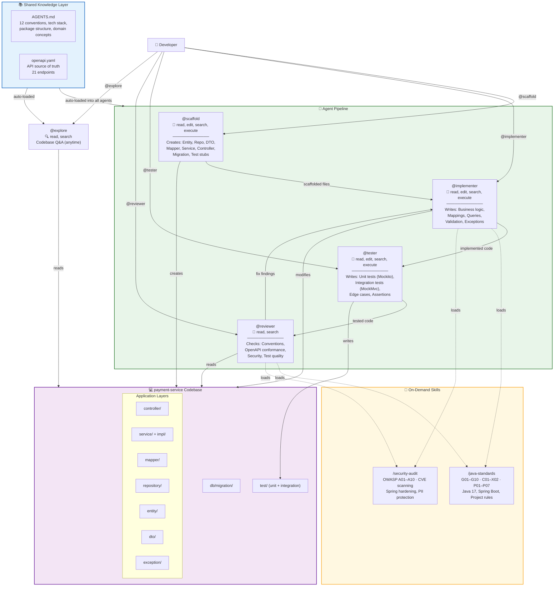
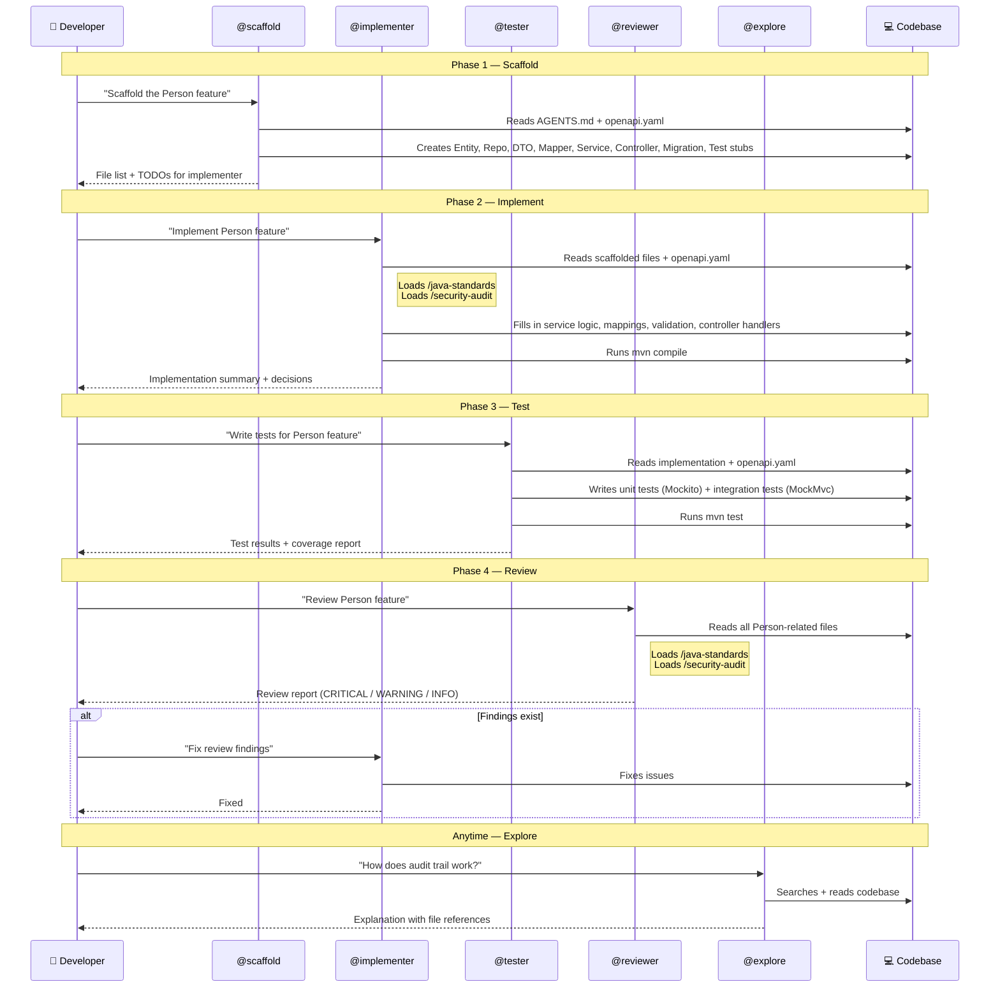
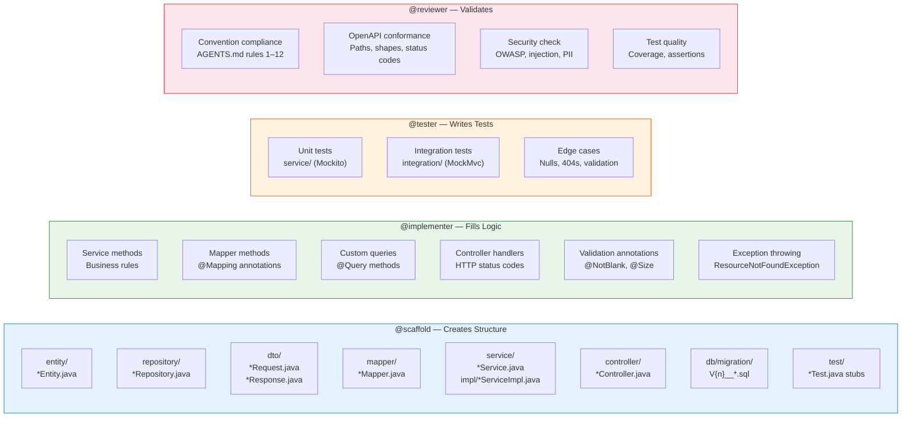
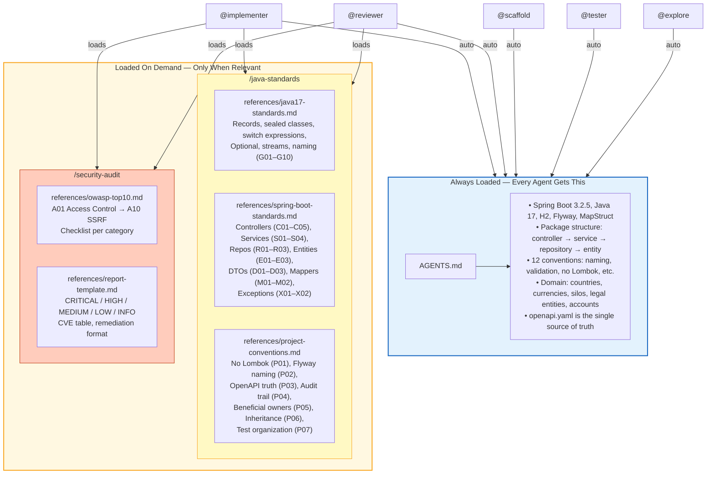
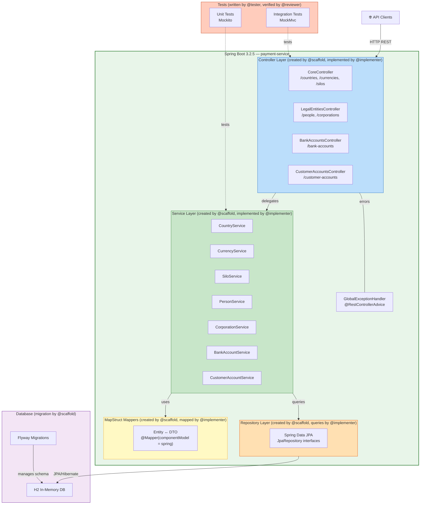
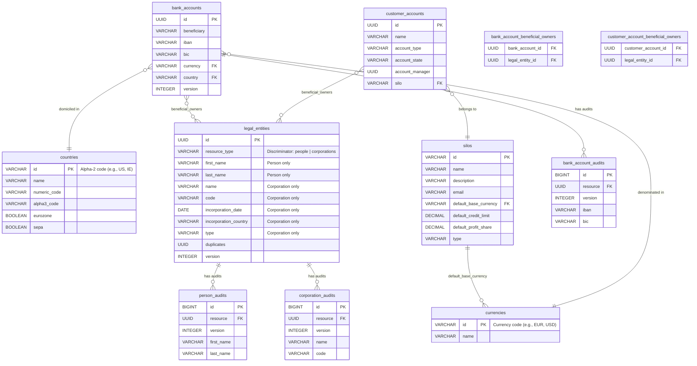
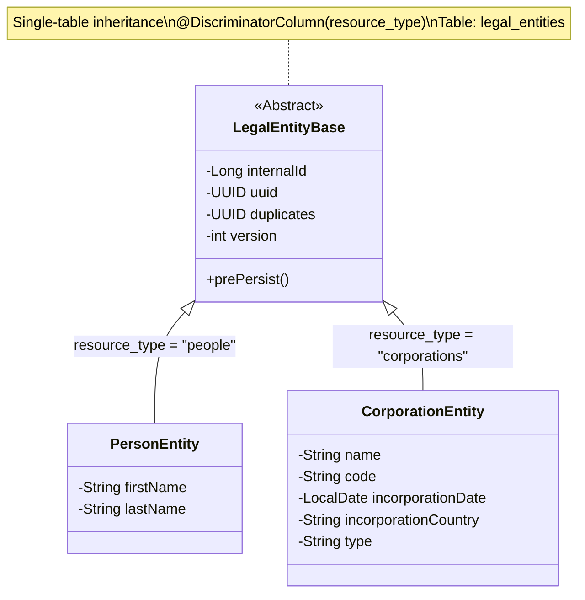
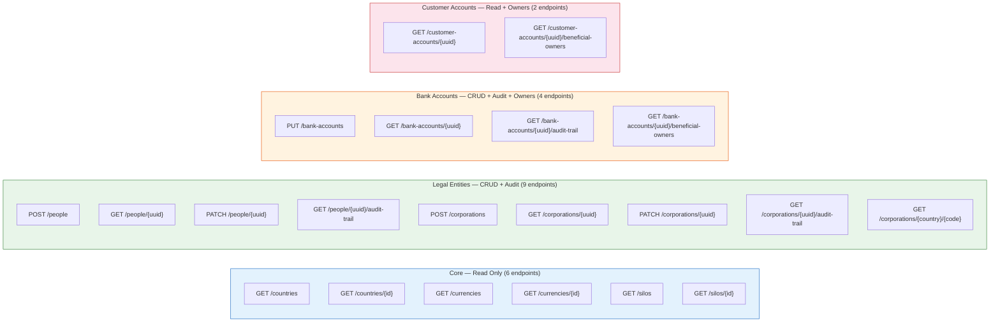
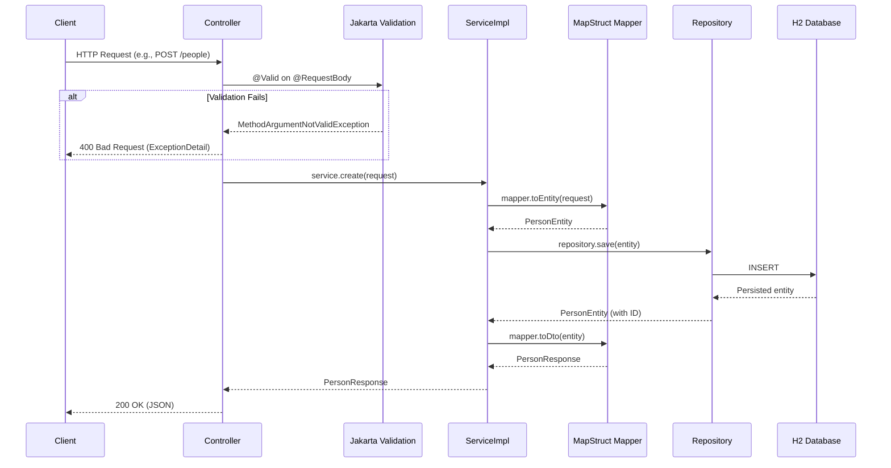
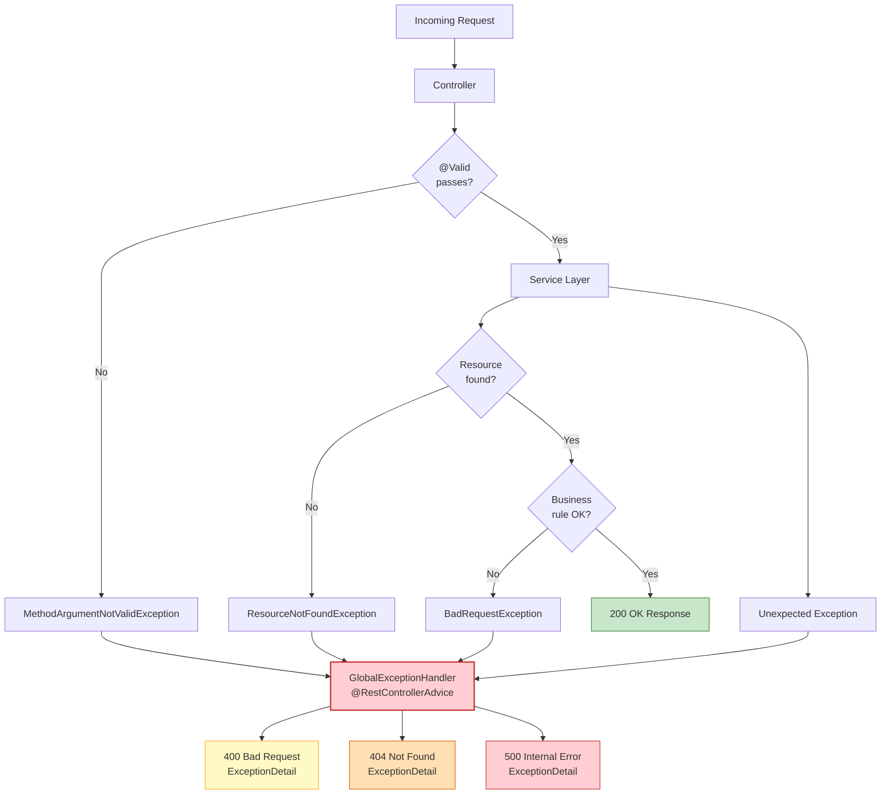

# Payment Service — Architecture Documentation

## 1. Overview

Payment-service is a Spring Boot 3.2.5 microservice (Java 17) built and maintained through an **agent-driven development workflow**. Four specialized AI agents collaborate in a pipeline — each with focused responsibilities, tool access, and shared knowledge — to scaffold, implement, test, and review the codebase.

---

## 2. Agent-Centric Architecture (Master View)



---

## 3. Agent Pipeline — Detailed Workflow



---

## 4. Agent Responsibilities Matrix



---

## 5. Knowledge & Skill Flow



---

## 6. What Agents Build — Application Architecture



---

## 7. Domain Model



---

## 8. Entity Inheritance (Legal Entities)



---

## 9. API Surface



**Total: 21 endpoints** across 4 controllers.

---

## 10. Request Flow (Sequence)



---

## 11. Error Handling Flow



---

## 12. File Structure Summary

```
payment-service/
├── AGENTS.md                               # Global agent instructions (loaded by ALL agents)
├── pom.xml                                 # Maven build + dependencies
├── README.md                               # Project documentation
├── docs/
│   └── architecture.md                     # This file
├── .github/
│   ├── agents/                             # Copilot custom agents
│   │   ├── scaffold.agent.md               # Phase 1: Boilerplate generator
│   │   ├── implementer.agent.md            # Phase 2: Business logic writer
│   │   ├── tester.agent.md                 # Phase 3: Test writer
│   │   └── reviewer.agent.md              # Phase 4: Code reviewer
│   └── skills/                             # On-demand knowledge
│       ├── java-standards/                 # Java 17 + Spring Boot standards
│       │   ├── SKILL.md
│       │   └── references/
│       │       ├── java17-standards.md     # G01–G10
│       │       ├── spring-boot-standards.md # C01–X02
│       │       └── project-conventions.md  # P01–P07
│       └── security-audit/                 # OWASP + CVE audit
│           ├── SKILL.md
│           └── references/
│               ├── owasp-top10.md          # A01–A10 checklist
│               └── report-template.md      # Severity format
├── src/
│   ├── main/
│   │   ├── java/com/techwave/paymentservice/
│   │   │   ├── PaymentServiceApplication.java
│   │   │   ├── controller/                 # 4 REST controllers
│   │   │   ├── service/                    # 7 service interfaces
│   │   │   │   └── impl/                   # 7 service implementations
│   │   │   ├── repository/                 # JPA repositories
│   │   │   ├── entity/                     # JPA entities
│   │   │   ├── dto/                        # Request/Response DTOs
│   │   │   ├── mapper/                     # MapStruct mappers
│   │   │   └── exception/                  # Error handling
│   │   └── resources/
│   │       ├── application.yml
│   │       ├── openapi.yaml                # API source of truth (21 endpoints)
│   │       └── db/migration/               # Flyway SQL scripts
│   └── test/java/.../
│       ├── service/                        # Unit tests (Mockito)
│       └── integration/                    # Integration tests (MockMvc)
```
